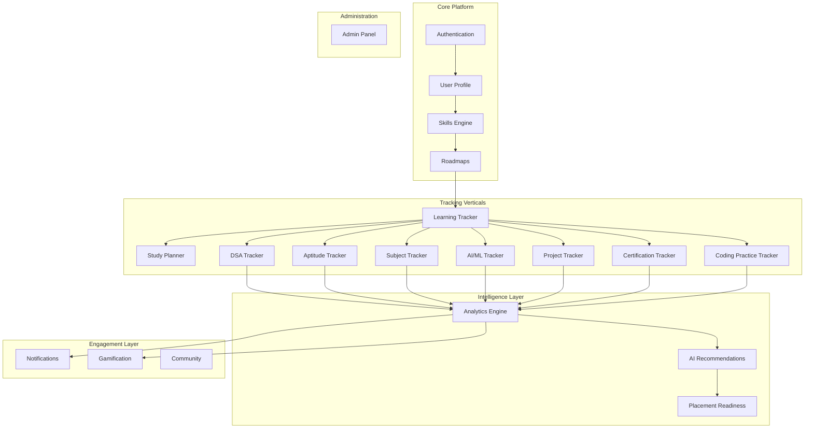
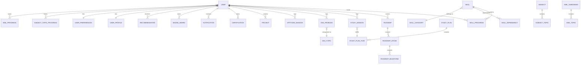
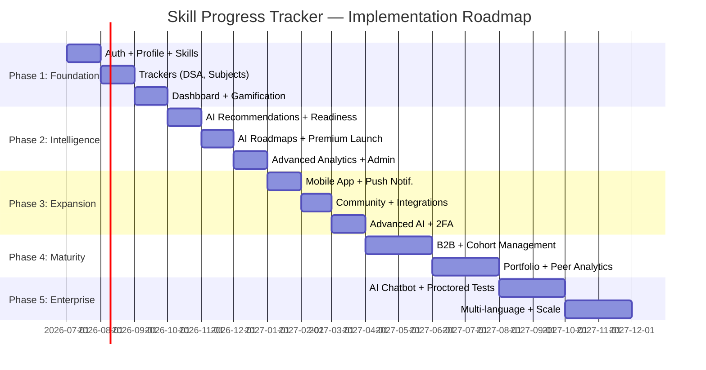

# Skill Progress Tracker — Product Requirement Document & System Blueprint

**Version:** 1.0  
**Date:** June 22, 2026  
**Classification:** Confidential — Internal  
**Authors:** Product, Architecture & Engineering Teams  
**Status:** Draft — Awaiting Stakeholder Review

---

> [!NOTE]
> This document serves as the single source of truth for the Skill Progress Tracker platform. It is designed to be comprehensive enough that a team of engineers can build the entire product without additional clarification.

---

## Table of Contents

1. [Executive Summary](#1-executive-summary)
2. [User Personas](#2-user-personas)
3. [Product Modules](#3-product-modules)
4. [Functional Requirements](#4-functional-requirements)
5. [Non-Functional Requirements](#5-non-functional-requirements)
6. [User Flows](#6-user-flows)
7. [Feature Inventory](#7-feature-inventory)
8. [Edge Cases](#8-edge-cases)
9. [Role-Based Access Control](#9-role-based-access-control)
10. [Data Model Design](#10-data-model-design)
11. [Database Blueprint](#11-database-blueprint)
12. [System Architecture](#12-system-architecture)
13. [Folder Structure](#13-folder-structure)
14. [API Architecture Plan](#14-api-architecture-plan)
15. [Security Architecture](#15-security-architecture)
16. [Analytics Design](#16-analytics-design)
17. [AI System Design](#17-ai-system-design)
18. [Dashboard Specification](#18-dashboard-specification)
19. [Scalability Plan](#19-scalability-plan)
20. [Implementation Roadmap](#20-implementation-roadmap)

---

# 1. Executive Summary

## 1.1 Problem Statement

The modern learning landscape is fragmented. Students, job seekers, and professionals use dozens of disconnected tools — spreadsheets for DSA tracking, Notion boards for study plans, YouTube playlists for learning, and isolated LeetCode dashboards for coding practice. There is **no unified platform** that:

- Consolidates all skill-tracking verticals (DSA, aptitude, core CS, AI/ML, projects, certifications) into a single experience.
- Provides **AI-driven intelligence** to identify gaps, recommend next steps, and estimate placement readiness.
- Adapts to the user's pace, strengths, and career goals with **personalized learning paths**.
- Delivers **actionable analytics** rather than raw data dumps.

The result: learners waste 20–30% of their study time on suboptimal strategies, lack visibility into their true readiness, and enter interviews with blind spots they don't know exist.

## 1.2 Target Audience

| Segment | Size (India TAM) | Pain Intensity |
|---|---|---|
| Engineering college students (Years 2–4) | ~4.5M annually | Very High |
| Placement-bound candidates (active prep) | ~1.2M annually | Critical |
| Working software engineers (upskilling) | ~5M+ | High |
| Career switchers (non-CS → tech) | ~800K annually | Very High |
| AI/ML learners (specialized track) | ~600K annually | High |
| Working professionals (continuous learning) | ~3M+ | Moderate |

**Primary:** College students and placement candidates (Tier 1–3 colleges in India).  
**Secondary:** Working engineers, career switchers, and AI/ML learners globally.  
**Tertiary:** Enterprises, bootcamps, and educational institutions (B2B).

## 1.3 Value Proposition

> **"Your entire learning journey — tracked, analyzed, and optimized — in one intelligent platform."**

| For Users | For the Business |
|---|---|
| Unified dashboard across all learning verticals | SaaS subscription revenue (B2C + B2B) |
| AI-powered gap analysis and recommendations | Data moat from aggregated learning patterns |
| Placement readiness scoring with confidence intervals | Upsell path: Free → Premium → Enterprise |
| Adaptive study plans that evolve with the user | Network effects from community & mentorship |
| Gamification that sustains motivation over months | Partnership revenue (placement agencies, ed-tech) |

## 1.4 Business Goals

| ID | Goal | Target | Timeframe |
|---|---|---|---|
| BG-01 | Acquire registered users | 50,000 | 12 months post-launch |
| BG-02 | Achieve monthly active users (MAU) | 15,000 | 12 months |
| BG-03 | Premium conversion rate | 5–8% of MAU | 18 months |
| BG-04 | User retention (D30) | ≥ 40% | 6 months |
| BG-05 | Net Promoter Score (NPS) | ≥ 50 | 12 months |
| BG-06 | B2B institutional partnerships | 10 colleges | 18 months |
| BG-07 | Monthly recurring revenue (MRR) | $25,000 | 18 months |

## 1.5 Product Goals

| ID | Goal | Success Metric |
|---|---|---|
| PG-01 | Be the single source of truth for learning progress | ≥ 80% of active users track ≥ 3 verticals |
| PG-02 | Deliver actionable AI recommendations | ≥ 60% recommendation acceptance rate |
| PG-03 | Accurately predict placement readiness | ≤ 15% deviation from actual outcomes |
| PG-04 | Sustain long-term engagement | Average session duration ≥ 8 min |
| PG-05 | Enable self-service learning path creation | ≥ 70% of roadmaps created without support |
| PG-06 | Support mobile-first usage patterns | ≥ 55% of sessions from mobile |

---

# 2. User Personas

## 2.1 Persona 1 — College Student ("Priya")

### Background
- **Age:** 20 | **Location:** Pune, India | **Year:** 3rd year B.Tech CSE
- Studies at a Tier-2 engineering college
- Comfortable with English; uses a mix of Hindi and English in daily life
- Owns an Android phone (primary device) and a budget laptop
- Active on LinkedIn, Instagram; follows tech YouTubers

### Goals
- Build a strong DSA foundation (target: 300+ problems solved before placements)
- Learn core CS subjects well enough to clear technical rounds
- Complete 2–3 real projects for her resume
- Get placed at a product-based company with ≥ ₹10 LPA CTC

### Pain Points
- **Scattered tracking:** Uses Excel for DSA, Notion for study plans, and memory for everything else
- **No visibility into gaps:** Doesn't know which topics she's weak in until she fails a mock interview
- **Motivation decay:** Starts strong each semester, loses momentum by week 3
- **Information overload:** Doesn't know which resources to prioritize among hundreds of options
- **No feedback loop:** No way to know if her current pace will get her ready in time

### User Journey
1. Discovers the platform via a college placement WhatsApp group.
2. Signs up, selects "Placement Preparation" as her primary goal.
3. Takes a skill assessment quiz for DSA and core CS.
4. Receives a personalized 90-day study roadmap.
5. Logs daily DSA problems, marking topics, difficulty, and time spent.
6. Reviews weekly analytics showing topic-wise mastery.
7. Gets an AI alert: "Your graph problems are below target. Add 5 problems this week."
8. Completes a mock assessment; platform updates her placement readiness score.
9. Shares her progress badge on LinkedIn.

---

## 2.2 Persona 2 — Placement Candidate ("Rahul")

### Background
- **Age:** 22 | **Location:** Hyderabad, India | **Year:** Final year B.Tech IT
- Has 45 days until his campus placement drive
- Moderate DSA skills (150 problems solved), weak in OS and CN
- Has built 1 project (a basic CRUD app)
- Uses a Windows laptop as primary device

### Goals
- Maximize placement readiness in a compressed timeline
- Identify and close critical skill gaps immediately
- Practice aptitude and verbal reasoning for initial screening rounds
- Prepare HR and behavioral interview responses

### Pain Points
- **Time panic:** Doesn't know what to prioritize with limited time
- **False confidence:** Thinks he's ready for arrays/strings but hasn't done medium/hard problems
- **No mock interview structure:** Practices randomly without simulating real interview pressure
- **Subject gaps:** Hasn't revised DBMS or CN since 2nd year and doesn't know what's important
- **Emotional stress:** Comparison with peers who seem more prepared

### User Journey
1. Signs up with urgency; selects "Placement in 45 days" as his timeline.
2. AI generates an accelerated roadmap prioritizing high-impact topics.
3. Daily study planner breaks down exactly what to cover each day.
4. Logs aptitude practice sessions and core CS revision.
5. Platform identifies CN as critically weak — moves it up in priority.
6. Takes daily mini-assessments; readiness score climbs from 42% to 71%.
7. Receives notification: "You're on track for your placement timeline. Keep going!"
8. Enters placement drive feeling prepared and informed.

---

## 2.3 Persona 3 — Software Engineer ("Arjun")

### Background
- **Age:** 26 | **Location:** Bengaluru, India | **Role:** SDE-1 at a mid-stage startup
- 2.5 years of experience in backend development (Node.js, Python)
- Wants to get promoted to SDE-2 or switch to a FAANG company
- Uses a MacBook Pro; comfortable with developer tools
- Active on GitHub, Twitter/X, and tech communities

### Goals
- Level up system design knowledge for senior-level interviews
- Learn cloud architecture (AWS) and get certified
- Build a portfolio of open-source contributions
- Track progress toward FAANG interview readiness

### Pain Points
- **No structured upskilling path:** Learns randomly based on blog posts and YouTube videos
- **Time fragmentation:** Can only study 1–2 hours on weekdays after work
- **Certification tracking is manual:** Doesn't track which courses he's completed, paused, or abandoned
- **System design is hard to self-assess:** No objective way to measure system design readiness
- **Imposter syndrome:** Doesn't know how he compares to successful FAANG candidates

### User Journey
1. Signs up; selects "Interview Preparation — FAANG" as his goal.
2. Imports his LeetCode and GitHub activity for baseline assessment.
3. Creates a custom roadmap: System Design + Advanced DSA + AWS Certification.
4. Logs daily progress in 30-minute study blocks.
5. Platform recommends system design case studies based on his weak areas.
6. Tracks AWS certification progress with milestone deadlines.
7. Reviews monthly analytics: "You've improved 23% in system design concepts."
8. Gets a readiness report before scheduling FAANG interviews.

---

## 2.4 Persona 4 — Career Switcher ("Meera")

### Background
- **Age:** 29 | **Location:** Mumbai, India | **Background:** Mechanical Engineering → wants to enter tech
- Working as a design engineer at a manufacturing firm
- Started learning Python 3 months ago through Coursera
- Has no CS degree; self-taught; uses a Windows desktop
- Feels overwhelmed by the breadth of topics to learn

### Goals
- Transition to a software engineering role within 12 months
- Build foundational CS knowledge (DSA, OOP, databases)
- Create 3 portfolio projects demonstrating practical skills
- Understand what skills are required for entry-level tech roles

### Pain Points
- **No roadmap:** Doesn't know the sequence — should she learn DSA first, or build projects?
- **Imposter syndrome amplified:** No CS degree makes her doubt herself constantly
- **Resource quality uncertainty:** Can't distinguish good courses from bad ones
- **No peer group:** Learns in isolation; no one to compare progress with or get guidance from
- **Progress feels invisible:** Months of learning but no tangible proof of advancement

### User Journey
1. Signs up; selects "Career Switch to Tech" and sets a 12-month timeline.
2. AI onboarding assesses her current skills (Python basics, no DSA).
3. Receives a phased roadmap: Fundamentals → DSA → Projects → Interview Prep.
4. Logs course completion, coding exercises, and project milestones.
5. Earns skill badges as she progresses (e.g., "Python Intermediate," "SQL Basics").
6. AI suggests building a specific project type based on her mechanical engineering domain knowledge.
7. Joins the platform's community channel for career switchers.
8. After 8 months, her readiness score suggests she's ready for entry-level applications.

---

## 2.5 Persona 5 — Working Professional ("Vikram")

### Background
- **Age:** 34 | **Location:** Delhi, India | **Role:** Technical Lead at a consulting firm
- 10 years of experience; deep expertise in Java and enterprise systems
- Wants to stay relevant as the industry shifts toward AI and cloud-native
- Has very limited free time (30 min/day on weekdays, 2–3 hours on weekends)
- Manages a team of 6; needs leadership skill development too

### Goals
- Upskill in AI/ML fundamentals without becoming a full-time student
- Get an AWS Solutions Architect certification
- Track professional development for annual performance reviews
- Maintain a "learning portfolio" to demonstrate continuous growth

### Pain Points
- **Extreme time scarcity:** Needs a platform that respects his 30 min/day constraint
- **Learning debt:** Has a backlog of 20+ courses started but never finished
- **No micro-learning support:** Most platforms assume 2+ hour study sessions
- **Performance review artifacts:** Needs exportable evidence of learning for HR reviews
- **Relevance anxiety:** Worried about being overtaken by younger engineers with AI skills

### User Journey
1. Signs up; selects "Continuous Professional Development" as his mode.
2. Sets availability: 30 min weekdays, 2 hours weekends.
3. AI creates a micro-learning plan with 25-minute daily modules.
4. Logs completion of course chapters, articles, and certification modules.
5. Platform aggregates monthly learning reports for performance review submission.
6. Gets curated AI/ML content recommendations aligned with his Java background.
7. Earns a "Consistent Learner — 30 Day Streak" badge.
8. Exports a quarterly learning portfolio PDF for his manager.

---

## 2.6 Persona 6 — AI/ML Learner ("Sanya")

### Background
- **Age:** 23 | **Location:** Chennai, India | **Status:** Recent CS graduate
- Completed a standard CS curriculum; strong in programming, basic math
- Fascinated by AI/ML; wants to become an ML Engineer
- Has completed Andrew Ng's ML course but hasn't applied knowledge to real problems
- Uses a Linux laptop with GPU access through Google Colab

### Goals
- Build a structured path from ML basics to production ML engineering
- Master the mathematical foundations (linear algebra, probability, statistics)
- Complete a deep learning specialization and build an NLP project
- Track progress across the wide AI/ML learning landscape
- Eventually contribute to open-source AI projects

### Pain Points
- **Vastness of the field:** AI/ML has too many sub-domains; doesn't know where to focus
- **Math anxiety:** Knows math is important but avoids it; needs structured math progression
- **Theory-practice gap:** Can follow tutorials but struggles to build from scratch
- **Rapidly evolving field:** New frameworks (LangChain, CrewAI) appear monthly; hard to keep up
- **No portfolio strategy:** Doesn't know which projects would impress ML hiring managers

### User Journey
1. Signs up; selects "AI/ML Career Path" as her primary track.
2. Takes a diagnostic quiz: strong in Python, weak in math foundations, no DL experience.
3. Receives a 6-month roadmap: Math → Classical ML → Deep Learning → NLP → Projects.
4. Logs daily progress: course chapters, Kaggle competitions, math exercises.
5. AI detects she's spending too long on theory; suggests a hands-on mini-project.
6. Tracks her Kaggle rankings and model performance metrics.
7. Platform recommends learning Generative AI after she completes NLP fundamentals.
8. Builds a portfolio tracked entirely within the platform; exports to a personal website.

---

# 3. Product Modules

## 3.1 Module Overview



---

## 3.2 Module Details

### M-01: Authentication Module

| Attribute | Detail |
|---|---|
| **Purpose** | Secure user identity management, session handling, and access control |
| **Features** | Email/password registration · Social login (Google, GitHub, LinkedIn) · Email verification · Password reset · Two-factor authentication (Phase 2) · Session management · JWT token lifecycle · OAuth 2.0 provider integration · Account deactivation/deletion · Login history & device management |
| **User Interactions** | Sign up form · Login form · "Forgot Password" flow · Social login buttons · Email verification page · Logout action · Session expiry notification |

---

### M-02: User Profile Module

| Attribute | Detail |
|---|---|
| **Purpose** | Manage user identity, preferences, goals, and personalization context |
| **Features** | Profile creation & editing · Avatar upload · Goal setting (career goal, timeline, target companies) · Skill self-assessment during onboarding · Learning preferences (pace, time availability, preferred content types) · Education & work history · Social links (GitHub, LinkedIn, LeetCode) · Profile visibility settings · Export profile as PDF/portfolio · Timezone & language preferences |
| **User Interactions** | Onboarding wizard (multi-step) · Profile settings page · Goal configuration modal · Preference toggles · Avatar cropper · Resume/portfolio export button |

---

### M-03: Skills Engine Module

| Attribute | Detail |
|---|---|
| **Purpose** | Central skill taxonomy, proficiency tracking, and skill relationship management |
| **Features** | Hierarchical skill tree (Category → Subcategory → Skill → Sub-skill) · Proficiency levels (Unaware, Beginner, Intermediate, Advanced, Expert) · Skill tagging and grouping · Custom skill creation · Skill endorsement (by mentors) · Skill dependencies (e.g., "Learn Arrays before Dynamic Programming") · Skill search with auto-suggest · Bulk skill import · Skill archival and reactivation · Proficiency history tracking |
| **User Interactions** | Skill browser/explorer · "Add Skill" modal · Proficiency slider/selector · Skill dependency visualization · Skill search bar · Skill detail page (history, related resources) |

---

### M-04: Roadmaps Module

| Attribute | Detail |
|---|---|
| **Purpose** | Structured learning path creation, visualization, and progress tracking |
| **Features** | AI-generated roadmaps based on goals and current skill levels · Manual roadmap creation (drag-and-drop) · Pre-built roadmap templates (e.g., "Frontend Developer in 6 months") · Roadmap stages with milestones · Time estimation per stage · Roadmap sharing (public/private) · Roadmap forking (copy and customize someone else's roadmap) · Progress overlay on roadmap visualization · Roadmap versioning · Dependency-aware sequencing |
| **User Interactions** | Roadmap gallery (browse templates) · Roadmap builder (visual editor) · "Generate My Roadmap" AI flow · Roadmap detail view with progress indicators · Milestone completion checkboxes · Roadmap sharing modal |

---

### M-05: Learning Tracker Module

| Attribute | Detail |
|---|---|
| **Purpose** | Central hub for logging and monitoring daily learning activities across all verticals |
| **Features** | Daily learning log (what was studied, duration, quality self-rating) · Weekly and monthly activity calendars (GitHub-style heatmap) · Streak tracking (current streak, longest streak, streak recovery) · Session timer with pause/resume · Learning journal (free-text reflections) · Activity categorization (reading, coding, watching, practicing) · Cross-vertical aggregation (see all verticals in one timeline) · Daily/weekly/monthly summary generation · Export learning history as CSV |
| **User Interactions** | "Log Activity" quick-action button (FAB on mobile) · Activity calendar view · Streak display widget · Timer start/stop · Journal entry modal · Summary email digest (weekly) |

---

### M-06: Study Planner Module

| Attribute | Detail |
|---|---|
| **Purpose** | AI-assisted daily/weekly study schedule generation and adherence tracking |
| **Features** | AI-generated study plans based on roadmap, deadline, and availability · Manual plan creation · Calendar integration (Google Calendar, Outlook) · Daily task list with time blocks · Plan adjustment based on actual progress (adaptive rescheduling) · Pomodoro timer integration · Plan templates (e.g., "4-hour weekend study block") · Conflict detection (overlapping commitments) · Plan completion analytics · Carry-forward of incomplete tasks |
| **User Interactions** | Weekly planner view (calendar grid) · Daily task checklist · "Plan My Week" AI button · Drag-and-drop task rearrangement · Pomodoro timer widget · Calendar sync settings |

---

### M-07: DSA Tracker Module

| Attribute | Detail |
|---|---|
| **Purpose** | Comprehensive Data Structures & Algorithms practice tracking and analysis |
| **Features** | Problem logging (name, platform, topic, difficulty, time taken, status) · Topic-wise progress breakdown (Arrays, Linked Lists, Trees, Graphs, DP, etc.) · Difficulty distribution tracking (Easy/Medium/Hard) · Platform integration indicators (LeetCode, Codeforces, HackerRank) · Revision scheduler (spaced repetition for solved problems) · Problem tagging (custom tags like "needs revision," "brute force only") · Pattern recognition tracking (e.g., "Sliding Window" pattern problems) · Daily/weekly problem targets · Time complexity self-assessment per problem · Company-wise problem lists (e.g., "Google Top 50") |
| **User Interactions** | "Log Problem" form · Topic-wise dashboard (bar charts, pie charts) · Problem list with filters and sorting · Revision reminder notifications · Problem detail view (notes, complexity, approach) · Import from LeetCode (Phase 2) |

---

### M-08: Aptitude Tracker Module

| Attribute | Detail |
|---|---|
| **Purpose** | Track quantitative, logical, and verbal reasoning practice for placement screening |
| **Features** | Category tracking (Quantitative, Logical Reasoning, Verbal, Data Interpretation) · Sub-topic breakdown (e.g., Quant → Percentages, Profit & Loss, Time & Work) · Practice session logging (questions attempted, correct, time per question) · Accuracy tracking over time · Speed tracking (questions per minute) · Mock test score logging · Comparison with target scores · Weak topic identification · Improvement trend visualization |
| **User Interactions** | "Log Practice" form · Topic-wise accuracy charts · Speed vs. accuracy scatter plots · Mock test history table · Weak area highlights · Target score progress bar |

---

### M-09: Subject Tracker Module

| Attribute | Detail |
|---|---|
| **Purpose** | Track core CS subject knowledge across DBMS, OS, CN, OOP, and SQL |
| **Features** | Subject-wise topic lists (e.g., OS → Process Management, Memory Management, File Systems, etc.) · Topic status (Not Started, In Progress, Revised, Mastered) · Notes attachment per topic · Resource linking per topic (articles, videos, books) · Revision cycle tracking (first read, first revision, second revision) · Self-assessment quizzes per topic · Cross-subject dependency mapping (e.g., OS memory management → DBMS buffer management) · Exam/interview readiness score per subject |
| **User Interactions** | Subject dashboard with topic completion grids · Topic detail page (status, notes, resources) · "Mark as Revised" button · Quiz launcher · Readiness gauge per subject |

---

### M-10: AI/ML Tracker Module

| Attribute | Detail |
|---|---|
| **Purpose** | Specialized tracking for the AI/ML learning journey across its many sub-domains |
| **Features** | Sub-domain tracking: Mathematics, Python, Machine Learning, Deep Learning, NLP, Computer Vision, Generative AI, Agentic AI, Prompt Engineering · Mathematical prerequisite mapping (Linear Algebra → ML, Probability → DL, Calculus → Backpropagation) · Model implementation logging (algorithm name, dataset, metrics achieved) · Paper reading tracker · Kaggle competition tracking · Framework proficiency tracking (PyTorch, TensorFlow, scikit-learn, LangChain) · Research vs. engineering skill balance · Specialization path suggestions |
| **User Interactions** | AI/ML dashboard with sub-domain radar chart · Model implementation log form · Paper reading checklist · Kaggle profile integration summary · Framework skill bars · Math prerequisite progress tree |

---

### M-11: Project Tracker Module

| Attribute | Detail |
|---|---|
| **Purpose** | Track personal, academic, and portfolio projects from ideation to deployment |
| **Features** | Project creation with metadata (title, description, tech stack, start date, target date) · Project phases (Ideation, Design, Development, Testing, Deployment, Maintenance) · Milestone tracking within projects · GitHub repository linking · Deployment URL tracking · Skills used per project (auto-tag from tech stack) · Project complexity rating · Screenshots/demo links · Project completion percentage · Portfolio export (combine multiple projects into a showcase page) |
| **User Interactions** | "New Project" wizard · Project card grid (Kanban-style) · Phase progress timeline · Milestone checklist · GitHub commit activity widget (linked repo) · Portfolio builder page |

---

### M-12: Certification Tracker Module

| Attribute | Detail |
|---|---|
| **Purpose** | Track professional certifications, courses, and credentials end-to-end |
| **Features** | Certification logging (name, issuing body, date earned, expiry date, credential URL) · Course progress tracking (for in-progress certifications) · Certification verification link storage · Renewal/expiry reminders · Course completion percentage · Certification categorization (Cloud, Data, Security, etc.) · Skills mapped per certification · Cost tracking · Certificate image upload · Certification goals (target certifications per year) |
| **User Interactions** | "Add Certification" form · Certification timeline view · In-progress course progress bars · Expiry alert notifications · Certificate gallery view · Certification goal tracker |

---

### M-13: Coding Practice Tracker Module

| Attribute | Detail |
|---|---|
| **Purpose** | Track general coding practice, contests, and competitive programming activity |
| **Features** | Contest logging (platform, rank, problems solved, rating change) · Rating history tracking across platforms · Daily coding activity log · Language-wise practice breakdown · Contest performance trends · Coding challenge bookmarks (problems to retry) · Personal best tracking · Time-based practice goals (e.g., "code 1 hour daily") · Code snippet journal (save interesting solutions) |
| **User Interactions** | "Log Contest" form · Rating history line chart · Daily coding heatmap · Language pie chart · Contest history table · Practice goal progress ring |

---

### M-14: AI Recommendations Module

| Attribute | Detail |
|---|---|
| **Purpose** | Deliver intelligent, context-aware suggestions to optimize the user's learning journey |
| **Features** | Daily "Next Best Action" recommendation · Skill gap detection and alerts · Resource recommendations (courses, articles, problems) matched to skill level · Study plan adjustments based on progress velocity · Weak area prioritization · Learning style adaptation (theory-heavy vs. practice-heavy) · Peer comparison insights (anonymized) · Milestone celebration and next-milestone suggestions · Risk alerts ("At current pace, you won't complete your roadmap in time") · "What If" scenario modeling ("What if I study 2 more hours per week?") |
| **User Interactions** | Recommendation cards on dashboard · "Why this recommendation?" explainer · Accept/dismiss/snooze recommendation actions · Recommendation history · Preference feedback ("Was this helpful?") |

---

### M-15: Analytics Engine Module

| Attribute | Detail |
|---|---|
| **Purpose** | Transform raw progress data into meaningful insights and visualizations |
| **Features** | Progress dashboards (daily, weekly, monthly, all-time) · Skill radar charts · Topic-wise mastery heatmaps · Time investment breakdown (by vertical, by topic) · Streak and consistency metrics · Goal completion forecasting · Comparative analytics (this week vs. last week) · Learning velocity tracking (skills gained per unit time) · Exportable reports (PDF, CSV) · Custom date range analysis |
| **User Interactions** | Analytics dashboard with multiple widget layouts · Date range selector · Chart type toggles · Drill-down from summary to detail · Report download buttons · Share analytics snapshot |

---

### M-16: Placement Readiness Module

| Attribute | Detail |
|---|---|
| **Purpose** | Aggregate multi-dimensional data to provide a holistic interview/placement readiness score |
| **Features** | Composite readiness score (0–100) with breakdown · Dimension scores: DSA, Aptitude, Core CS, Projects, Communication, Coding Speed · Readiness trajectory (score over time) · Target company matching (based on known requirements) · Gap analysis report ("To reach readiness for Company X, improve these areas") · Mock interview readiness flags · Peer percentile ranking (anonymized) · Readiness certificate generation (shareable) · Timeline projection ("Ready for placement by Date X at current pace") |
| **User Interactions** | Readiness dashboard with composite gauge · Dimension breakdown radar chart · Company fit cards · Gap analysis report view · Timeline projection slider · Shareable readiness badge |

---

### M-17: Notifications Module

| Attribute | Detail |
|---|---|
| **Purpose** | Timely, relevant, and non-intrusive alerts to drive engagement and prevent churn |
| **Features** | In-app notifications (bell icon, notification center) · Push notifications (mobile) · Email notifications (digests) · Notification categories: reminders, achievements, recommendations, alerts, system · User-configurable notification preferences (per category, per channel) · Do Not Disturb scheduling · Streak-at-risk alerts · Study reminder scheduling · Milestone achievement alerts · Weekly progress digest emails |
| **User Interactions** | Notification bell with unread count · Notification center (list with read/unread, filter by category) · Notification preferences page · "Snooze" and "Mark All Read" actions |

---

### M-18: Gamification Module

| Attribute | Detail |
|---|---|
| **Purpose** | Sustain motivation through game mechanics that reward consistency and achievement |
| **Features** | XP (experience points) system tied to activities · Level system (Level 1–50 with titles: Novice → Grandmaster) · Badges and achievements (100+ unique badges) · Streak rewards (escalating XP multiplier) · Leaderboards (friends, college, global) · Weekly challenges (community-wide events) · Skill tree unlocks (visual progression) · Profile showcasing (badges displayed on public profile) · Streak freeze tokens (allow one missed day without breaking streak) · Seasonal events (e.g., "Placement Season Sprint") |
| **User Interactions** | XP progress bar on dashboard · Badge gallery (earned and locked) · Leaderboard tabs · Challenge participation cards · Level-up celebration animation · Streak freeze activation |

---

### M-19: Community Module (Phase 2+)

| Attribute | Detail |
|---|---|
| **Purpose** | Peer learning, mentorship, and knowledge sharing |
| **Features** | Discussion forums (topic-based) · Study groups (private/public) · Mentor-mentee matching · Progress sharing (opt-in) · Resource sharing · Q&A threads · Community challenges · Peer code reviews · Success story showcasing · Event announcements |
| **User Interactions** | Forum thread list · Group chat · Mentor request form · Shared progress timeline · Resource bookmarking |

---

### M-20: Admin Panel Module

| Attribute | Detail |
|---|---|
| **Purpose** | Platform management, user moderation, content management, and operational insights |
| **Features** | User management (search, view, suspend, delete, impersonate) · Content management (skill taxonomy, roadmap templates, badge definitions) · Analytics dashboard (platform-wide metrics: DAU, MAU, retention, feature usage) · Feature flags management · Notification broadcast · Report generation · System health monitoring · Feedback/support ticket management · A/B test configuration · Audit log viewer |
| **User Interactions** | Admin dashboard with KPI cards · User search and detail pages · Content editor (skill taxonomy) · Feature flag toggles · Broadcast notification composer · Audit log search |

---

# 4. Functional Requirements

## 4.1 Authentication & Authorization

| ID | Description | Inputs | Outputs | Validation Rules | Dependencies |
|---|---|---|---|---|---|
| FR-001 | User can register with email and password | Email, password, display name | User account created, verification email sent | Email must be unique, valid format; Password ≥ 8 chars with 1 uppercase, 1 number, 1 special char; Display name 2–50 chars | Email service |
| FR-002 | User can register via Google OAuth | Google auth token | User account created or linked | Google account must have a verified email | Google OAuth API |
| FR-003 | User can register via GitHub OAuth | GitHub auth token | User account created or linked | GitHub account must exist | GitHub OAuth API |
| FR-004 | User can log in with email/password | Email, password | JWT access + refresh tokens | Credentials must match; Account must be verified; Max 5 failed attempts before 15-min lockout | User store |
| FR-005 | User can log in via social OAuth | OAuth provider token | JWT access + refresh tokens | OAuth token must be valid; Account must exist or auto-create | OAuth providers |
| FR-006 | User can request password reset | Email | Reset link email sent | Email must be registered; Rate limit: 3 requests per hour | Email service |
| FR-007 | User can reset password via token | Reset token, new password | Password updated, all sessions invalidated | Token must be valid and not expired (24h); New password must meet strength rules | — |
| FR-008 | User can verify email address | Verification token | Account marked as verified | Token must be valid and not expired (72h) | — |
| FR-009 | System can refresh expired access tokens | Refresh token | New access + refresh tokens | Refresh token must be valid and not revoked | Token store |
| FR-010 | User can log out | Session token | Session invalidated | Token must belong to requesting user | Session store |
| FR-011 | User can view and manage active sessions | Auth token | List of active sessions (device, IP, last active) | User must be authenticated | Session store |
| FR-012 | User can delete their account | Auth token, confirmation password | Account soft-deleted; 30-day grace period before hard delete | Password must match; Confirmation dialog required | All modules |

## 4.2 User Profile & Onboarding

| ID | Description | Inputs | Outputs | Validation Rules | Dependencies |
|---|---|---|---|---|---|
| FR-013 | User completes onboarding wizard | Goal selection, current skill self-assessment, timeline, availability | Profile populated, initial roadmap suggestion | At least 1 goal must be selected; Timeline must be future date; Availability 1–16 hours/day | Skills Engine, Roadmap Module |
| FR-014 | User can edit profile information | Display name, bio, avatar, education, work history, social links | Profile updated | Display name 2–50 chars; Bio ≤ 500 chars; Avatar ≤ 5MB (JPEG, PNG, WebP); URLs must be valid | Storage service |
| FR-015 | User can set learning preferences | Preferred content types, learning pace, daily time commitment | Preferences stored | Time commitment 0.5–16 hours; At least 1 content type selected | — |
| FR-016 | User can configure goal settings | Primary goal, target companies, target role, target timeline | Goals updated | Timeline must be ≥ 7 days in future; Max 10 target companies | — |
| FR-017 | User can export profile as portfolio PDF | Auth token, export preferences | PDF document generated and downloadable | Export rate limit: 5 per hour | PDF generation service |
| FR-018 | User can set profile visibility | Visibility level (private, friends, public) | Privacy settings updated | Must select one visibility level | — |

## 4.3 Skills Engine

| ID | Description | Inputs | Outputs | Validation Rules | Dependencies |
|---|---|---|---|---|---|
| FR-019 | User can browse the skill taxonomy | Optional: category filter, search query | Hierarchical skill tree | — | Skill catalog |
| FR-020 | User can add a skill to their profile | Skill ID, initial proficiency level | Skill added to user's skill list | Skill must exist in taxonomy; No duplicate skills per user; Max 200 skills per user | Skill catalog |
| FR-021 | User can create a custom skill | Skill name, category, description | Custom skill created and added to profile | Name 2–100 chars; Must not duplicate existing taxonomy skill name (case-insensitive) | — |
| FR-022 | User can update skill proficiency | Skill ID, new proficiency level | Proficiency updated; history entry created | Proficiency must be valid enum value (1–5); Change must be different from current | — |
| FR-023 | User can remove a skill from their profile | Skill ID | Skill removed from user's active list (soft delete); progress data retained | Skill must be in user's list | Progress records |
| FR-024 | System tracks skill proficiency history | Auto-triggered on proficiency change | Timestamped proficiency change log | — | FR-022 |
| FR-025 | User can view skill dependencies | Skill ID | List of prerequisite and dependent skills | — | Skill catalog |
| FR-026 | User can search skills with autocomplete | Search query (min 2 chars) | Ranked list of matching skills (max 10 suggestions) | Query must be ≥ 2 characters | Skill catalog search index |

## 4.4 Roadmaps

| ID | Description | Inputs | Outputs | Validation Rules | Dependencies |
|---|---|---|---|---|---|
| FR-027 | User can request AI-generated roadmap | Goal, current skills, timeline, availability | Structured roadmap with stages, milestones, and time estimates | Goal must be specified; Timeline ≥ 14 days | AI service, Skills Engine |
| FR-028 | User can create a manual roadmap | Title, description, stages (ordered list of skills/milestones) | Roadmap created | Title 3–100 chars; Min 2 stages; Max 50 stages | Skills Engine |
| FR-029 | User can browse roadmap templates | Optional: category filter | List of pre-built roadmap templates | — | Template catalog |
| FR-030 | User can fork a public roadmap | Source roadmap ID | New roadmap (copy) in user's account | Source must be public or shared; Max 20 active roadmaps per user | — |
| FR-031 | User can edit roadmap stages | Roadmap ID, stage modifications | Roadmap updated | Must be owner of roadmap; Stage count limits apply | — |
| FR-032 | User can mark roadmap milestones complete | Roadmap ID, milestone ID | Milestone marked done; roadmap progress updated | Must be owner; Milestone must be in roadmap | Progress Tracker |
| FR-033 | User can share a roadmap | Roadmap ID, visibility setting | Roadmap visibility updated (private/public/link-shared) | Must be owner | — |
| FR-034 | User can delete a roadmap | Roadmap ID | Roadmap soft-deleted | Must be owner; Confirmation required | — |
| FR-035 | System re-calculates roadmap timeline on progress update | Auto-triggered | Updated ETA for remaining milestones | — | FR-032, Analytics |

## 4.5 Learning & Progress Tracking

| ID | Description | Inputs | Outputs | Validation Rules | Dependencies |
|---|---|---|---|---|---|
| FR-036 | User can log a learning activity | Activity type, related skill/topic, duration (minutes), quality rating (1–5), notes | Activity record created; XP awarded | Duration must be 1–720 minutes; Quality rating 1–5; Notes ≤ 2000 chars; Date cannot be > 7 days in the past | Gamification |
| FR-037 | User can start/stop a live study timer | Start/stop action | Timed activity record created on stop | Timer max duration: 12 hours (auto-stop) | — |
| FR-038 | User can view activity calendar (heatmap) | Date range | Heatmap visualization data (date → activity count) | Date range max: 365 days | — |
| FR-039 | User can view current and longest streaks | — | Current streak count, longest streak count, streak start date | — | — |
| FR-040 | User can write a learning journal entry | Date, content, mood (optional) | Journal entry created | Content 1–5000 chars; Max 1 entry per day (editable) | — |
| FR-041 | User can export learning history | Date range, format (CSV/PDF) | Downloadable file | Max export range: 365 days; Rate limit: 3 exports per hour | Export service |

## 4.6 DSA Tracker

| ID | Description | Inputs | Outputs | Validation Rules | Dependencies |
|---|---|---|---|---|---|
| FR-042 | User can log a DSA problem | Problem name, platform, topic(s), difficulty, time taken, status (solved/attempted/unsolved), approach notes | Problem record created | Name 1–200 chars; Topics from predefined list; Difficulty: Easy/Medium/Hard; Time 1–600 min; Status must be valid enum | Skills Engine |
| FR-043 | User can view topic-wise DSA progress | — | Per-topic counts (solved, attempted) and percentages | — | FR-042 |
| FR-044 | User can view difficulty distribution | — | Counts by Easy/Medium/Hard | — | FR-042 |
| FR-045 | User can tag problems for revision | Problem ID, revision tag | Problem tagged | Problem must be logged by user | — |
| FR-046 | System generates revision schedule | Auto-triggered based on tagged problems | Spaced repetition schedule for revision | — | FR-045 |
| FR-047 | User can filter/sort problem list | Filter criteria (topic, difficulty, status, platform), sort field | Filtered and sorted problem list | — | FR-042 |
| FR-048 | User can set daily/weekly problem targets | Target count, target difficulty mix, target period | Target stored | Count 1–50/day or 1–200/week | — |
| FR-049 | User can track problems by company list | Company name | Filtered list of problems tagged to that company | Company must be in supported list (top 50 tech companies) | — |

## 4.7 Aptitude Tracker

| ID | Description | Inputs | Outputs | Validation Rules | Dependencies |
|---|---|---|---|---|---|
| FR-050 | User can log an aptitude practice session | Category, sub-topic, questions attempted, correct answers, time spent | Session record created | Attempted ≥ Correct ≥ 0; Time 1–300 min | — |
| FR-051 | User can view accuracy trends by topic | Topic, date range | Accuracy percentage over time (line chart data) | — | FR-050 |
| FR-052 | User can log a mock test score | Test name, total score, max score, section-wise breakdown | Mock test record created | Score ≤ Max score; Max score > 0 | — |
| FR-053 | User can view weak topics | — | Topics ranked by accuracy (ascending) | Minimum 5 sessions required for statistical significance | FR-050 |

## 4.8 Subject Tracker

| ID | Description | Inputs | Outputs | Validation Rules | Dependencies |
|---|---|---|---|---|---|
| FR-054 | User can view subject topic lists | Subject (DBMS/OS/CN/OOP/SQL) | List of topics with status | — | Subject catalog |
| FR-055 | User can update topic status | Topic ID, new status | Status updated; revision cycle tracked | Status must be valid enum (Not Started, In Progress, Revised, Mastered) | — |
| FR-056 | User can attach notes to a topic | Topic ID, note content | Note saved | Content ≤ 10,000 chars | — |
| FR-057 | User can link resources to a topic | Topic ID, resource URL, resource type | Resource linked | URL must be valid; Max 20 resources per topic | — |
| FR-058 | User can view subject readiness score | Subject | Composite readiness score (0–100) | Min 50% of topics must have a status for score to be generated | FR-055 |

## 4.9 AI/ML Tracker

| ID | Description | Inputs | Outputs | Validation Rules | Dependencies |
|---|---|---|---|---|---|
| FR-059 | User can track progress across AI/ML sub-domains | Sub-domain, topic, status, notes | Progress record created | Sub-domain must be from predefined list | — |
| FR-060 | User can log model implementations | Model name, algorithm, dataset, metrics (accuracy, F1, etc.), framework used | Implementation record created | At least model name and algorithm required | — |
| FR-061 | User can track paper readings | Paper title, authors, URL, status (To Read, Reading, Completed), key takeaways | Paper record created | Title required; Status valid enum | — |
| FR-062 | User can view AI/ML sub-domain radar chart | — | Radar chart data (proficiency per sub-domain) | Min 3 sub-domains must have activity | FR-059 |
| FR-063 | User can track Kaggle competitions | Competition name, rank, score, approach summary | Competition record created | Rank must be positive integer | — |

## 4.10 Project & Certification Tracker

| ID | Description | Inputs | Outputs | Validation Rules | Dependencies |
|---|---|---|---|---|---|
| FR-064 | User can create a project entry | Title, description, tech stack, phase, GitHub URL, deployment URL | Project created | Title 3–150 chars; Tech stack max 20 items; URLs must be valid if provided; Max 50 projects per user | — |
| FR-065 | User can update project phase | Project ID, new phase | Phase updated; completion percentage recalculated | Phase must be valid enum | — |
| FR-066 | User can add milestones to a project | Project ID, milestone description, target date | Milestone created | Max 30 milestones per project; Target date must be future | — |
| FR-067 | User can log a certification | Cert name, issuer, date earned, expiry date, credential URL, skills mapped | Certification created | Date earned ≤ today; Expiry date > earned date (if applicable); Max 100 certs per user | Skills Engine |
| FR-068 | User can track in-progress course for certification | Course name, total modules, completed modules, last activity date | Course progress updated | Completed ≤ Total; Total ≥ 1 | — |
| FR-069 | System sends certification expiry reminders | Auto-triggered 30, 14, and 7 days before expiry | Reminder notification sent | Only for certifications with expiry dates | Notifications |

## 4.11 AI Recommendations

| ID | Description | Inputs | Outputs | Validation Rules | Dependencies |
|---|---|---|---|---|---|
| FR-070 | System generates daily "Next Best Action" recommendation | User's progress data, goals, roadmap, available time | 1–3 prioritized action items | User must have ≥ 7 days of activity data | AI Service, Analytics |
| FR-071 | System detects and alerts on skill gaps | User's target profile vs. current proficiency | List of skill gaps ranked by impact | Comparison requires target profile to be set | Skills Engine, AI Service |
| FR-072 | System recommends learning resources | Skill gap, user preferences (content type, difficulty level) | Ranked list of resources (courses, articles, problems) | Resources must be from curated catalog | Resource catalog, AI Service |
| FR-073 | User can accept or dismiss a recommendation | Recommendation ID, action (accept/dismiss/snooze) | Recommendation status updated; feedback stored for ML training | — | — |
| FR-074 | System adjusts study plan based on progress | Current progress vs. plan, velocity changes | Updated study plan with rescheduled items | User must have an active study plan | Study Planner, Analytics |
| FR-075 | System generates "What If" scenario analysis | Hypothetical change (e.g., "+2 hours/week") | Projected impact on readiness score and timeline | Scenario parameters must be within realistic bounds | Analytics, AI Service |

## 4.12 Analytics & Placement Readiness

| ID | Description | Inputs | Outputs | Validation Rules | Dependencies |
|---|---|---|---|---|---|
| FR-076 | User can view progress dashboard | Optional: date range, vertical filter | Dashboard with aggregated metrics and visualizations | — | All tracker modules |
| FR-077 | User can view skill radar chart | — | Multi-axis radar chart (one axis per skill category) | Min 3 skills must have proficiency data | Skills Engine |
| FR-078 | User can view time investment breakdown | Date range | Time spent per vertical, per topic (treemap/pie chart data) | — | Learning Tracker |
| FR-079 | System calculates placement readiness score | Auto-triggered daily | Composite score (0–100) with dimension breakdown | User must have activity in ≥ 3 dimensions | All trackers, AI Service |
| FR-080 | User can view placement readiness trajectory | Date range | Readiness score over time (line chart data) | Min 7 data points required | FR-079 |
| FR-081 | User can compare this week vs. last week | — | Side-by-side metrics comparison | Min 2 weeks of data required | Analytics |
| FR-082 | System generates weekly progress report | Auto-triggered every Sunday | Summary email with key metrics, achievements, and recommendations | User must have notification preferences allowing weekly emails | Notifications, Analytics |

## 4.13 Notifications & Gamification

| ID | Description | Inputs | Outputs | Validation Rules | Dependencies |
|---|---|---|---|---|---|
| FR-083 | System sends in-app notifications | Trigger event, notification content, target user | Notification displayed in notification center | Content ≤ 500 chars | — |
| FR-084 | System sends push notifications (mobile) | Trigger event, title, body | Push notification delivered | User must have push enabled; Respect DND hours | Push notification service |
| FR-085 | User can configure notification preferences | Per-category toggles, per-channel toggles, DND schedule | Preferences saved | At least 1 channel must remain enabled for critical notifications | — |
| FR-086 | System awards XP for activities | Activity type, activity metadata | XP awarded; level-up check triggered | XP values defined per activity type in config | Gamification config |
| FR-087 | System awards badges for achievements | Achievement condition met | Badge awarded; notification sent | Badge must not already be earned (except repeatable badges) | FR-083 |
| FR-088 | User can view leaderboard | Leaderboard type (friends/college/global), time period | Ranked list of users with XP and level | Min 2 participants for leaderboard to display | — |
| FR-089 | User can activate streak freeze | Auth token | Streak freeze applied (1 day protection) | Max 2 streak freezes per month; Must have streak ≥ 3 days | — |
| FR-090 | User can view badges gallery | — | All badges (earned and locked) with descriptions and earn criteria | — | — |

## 4.14 Admin

| ID | Description | Inputs | Outputs | Validation Rules | Dependencies |
|---|---|---|---|---|---|
| FR-091 | Admin can search and view user details | Search query (email, name, ID) | User profile, activity summary, subscription status | Admin role required | RBAC |
| FR-092 | Admin can suspend/reactivate a user | User ID, action, reason | User status updated; notification sent to user | Admin role required; Reason required for suspension | Notifications |
| FR-093 | Admin can manage skill taxonomy | Skill CRUD operations | Taxonomy updated | Super Admin for delete; Admin for create/edit | Skills Engine |
| FR-094 | Admin can manage roadmap templates | Template CRUD operations | Template catalog updated | Admin role required | Roadmaps |
| FR-095 | Admin can view platform analytics | Date range, metric type | Platform-wide dashboard (DAU, MAU, retention, feature usage) | Admin role required | Analytics |
| FR-096 | Admin can send broadcast notifications | Target audience, content, channel | Notifications queued for delivery | Super Admin for global broadcast; Content ≤ 1000 chars | Notifications |
| FR-097 | Admin can manage feature flags | Flag name, status (enabled/disabled), rollout percentage | Feature flag updated | Super Admin required | Feature flag service |
| FR-098 | Admin can view audit logs | Date range, user filter, action filter | Filtered audit log entries | Admin role required; Max 90-day lookback | Audit log store |

---

# 5. Non-Functional Requirements

| ID | Category | Requirement | Measurable Target |
|---|---|---|---|
| NFR-001 | **Scalability** | System must support concurrent users without degradation | ≥ 10,000 concurrent users at launch; ≥ 100,000 concurrent users at scale |
| NFR-002 | **Scalability** | Database must handle growth in records | ≥ 100M progress records without query degradation (< 200ms p95) |
| NFR-003 | **Scalability** | API layer must scale horizontally | Auto-scale from 2 to 50 instances based on CPU/request-rate thresholds |
| NFR-004 | **Performance** | API response time for standard CRUD operations | p50 ≤ 100ms, p95 ≤ 300ms, p99 ≤ 800ms |
| NFR-005 | **Performance** | Dashboard page load time (including data fetch) | First Contentful Paint ≤ 1.5s; Time to Interactive ≤ 3s |
| NFR-006 | **Performance** | AI recommendation generation | ≤ 5 seconds for daily recommendations; ≤ 30 seconds for full roadmap generation |
| NFR-007 | **Performance** | Search results response time | ≤ 200ms for autocomplete; ≤ 500ms for full-text search |
| NFR-008 | **Availability** | System uptime SLA | ≥ 99.9% uptime (≤ 8.77 hours downtime per year) |
| NFR-009 | **Availability** | Planned maintenance windows | ≤ 2 hours per month during off-peak (2–4 AM IST) with advance notice |
| NFR-010 | **Reliability** | Data durability | Zero data loss; RPO (Recovery Point Objective) ≤ 1 hour |
| NFR-011 | **Reliability** | Disaster recovery | RTO (Recovery Time Objective) ≤ 4 hours; Active-passive failover |
| NFR-012 | **Reliability** | Graceful degradation | AI features fail gracefully (cached recommendations shown) without affecting core tracking functionality |
| NFR-013 | **Security** | Authentication | Industry-standard JWT with short-lived access tokens (15 min) and long-lived refresh tokens (7 days) |
| NFR-014 | **Security** | Data encryption | AES-256 encryption at rest; TLS 1.3 in transit; PII fields encrypted at application level |
| NFR-015 | **Security** | Password storage | bcrypt with cost factor ≥ 12; No plaintext password storage ever |
| NFR-016 | **Security** | Rate limiting | 100 requests/min per user for standard APIs; 10 requests/min for auth APIs; 5 requests/min for AI APIs |
| NFR-017 | **Security** | Vulnerability management | Zero critical/high CVEs in production; Automated dependency scanning weekly |
| NFR-018 | **Accessibility** | WCAG compliance | WCAG 2.1 Level AA compliance for all user-facing pages |
| NFR-019 | **Accessibility** | Screen reader support | All interactive elements must have ARIA labels; Semantic HTML throughout |
| NFR-020 | **Accessibility** | Keyboard navigation | All features accessible via keyboard-only navigation; Visible focus indicators |
| NFR-021 | **Usability** | Mobile responsiveness | Full functionality on viewports ≥ 320px width |
| NFR-022 | **Usability** | Onboarding completion rate | ≥ 70% of new users complete onboarding wizard within first session |
| NFR-023 | **Usability** | Error messages | All error states must display user-friendly messages with actionable guidance |
| NFR-024 | **Maintainability** | Code coverage | ≥ 80% unit test coverage; ≥ 60% integration test coverage |
| NFR-025 | **Maintainability** | Documentation | All APIs documented with OpenAPI 3.0; All modules have architecture docs |
| NFR-026 | **Maintainability** | Deployment frequency | ≥ 2 deployments per week with < 5% rollback rate |
| NFR-027 | **Extensibility** | Plugin architecture | New tracking verticals addable without modifying core codebase |
| NFR-028 | **Extensibility** | API versioning | All APIs versioned (v1, v2); Minimum 12-month deprecation notice for breaking changes |
| NFR-029 | **Auditability** | Action logging | All state-changing operations logged with actor, timestamp, before/after values |
| NFR-030 | **Auditability** | Admin actions | All admin actions logged immutably; Admin actions reviewable by Super Admin |
| NFR-031 | **Compliance** | Data privacy | GDPR-compliant: right to access, right to deletion, data portability |
| NFR-032 | **Compliance** | Data retention | User data retained for 30 days post-account deletion; Anonymized data retained for analytics |
| NFR-033 | **Compliance** | Cookie consent | Explicit cookie consent mechanism on first visit; Essential-only cookies by default |

---

# 6. User Flows

## 6.1 Flow 1 — Registration

```
[Landing Page]
    ├─→ Click "Sign Up"
    │
    ├─→ [Registration Form]
    │       ├─→ Enter: Display Name, Email, Password
    │       ├─→ OR: Click "Sign up with Google / GitHub / LinkedIn"
    │       │       └─→ [OAuth Provider Consent Screen]
    │       │               └─→ Authorize → Return to platform
    │       ├─→ Accept Terms of Service & Privacy Policy (checkbox)
    │       └─→ Click "Create Account"
    │
    ├─→ [Server Validation]
    │       ├─→ Check email uniqueness
    │       ├─→ Validate password strength
    │       ├─→ If validation fails → Show inline errors → Stay on form
    │       └─→ If validation passes → Create user (unverified) → Send verification email
    │
    ├─→ [Verification Pending Page]
    │       ├─→ "Check your email for a verification link"
    │       ├─→ "Resend verification email" button (rate limited: 1 per 2 min)
    │       └─→ User clicks link in email
    │
    ├─→ [Email Verification]
    │       ├─→ Validate token (not expired, not used)
    │       ├─→ If valid → Mark account verified → Redirect to onboarding
    │       └─→ If invalid/expired → Show error → "Resend" option
    │
    └─→ [Onboarding Wizard] (Flow 6.3)
```

---

## 6.2 Flow 2 — Login

```
[Landing Page or Direct URL]
    ├─→ Click "Log In"
    │
    ├─→ [Login Form]
    │       ├─→ Enter: Email, Password
    │       ├─→ OR: Click "Log in with Google / GitHub / LinkedIn"
    │       ├─→ Optional: "Remember me" checkbox
    │       └─→ Click "Log In"
    │
    ├─→ [Server Validation]
    │       ├─→ Check credentials
    │       ├─→ If incorrect → Show "Invalid email or password" (generic) → Increment fail counter
    │       │       └─→ If fail counter ≥ 5 → Lock account 15 min → Show lockout message
    │       ├─→ If account not verified → Show "Please verify your email" → "Resend" link
    │       ├─→ If account suspended → Show "Account suspended. Contact support."
    │       └─→ If correct → Issue JWT (access + refresh) → Store in httpOnly cookies
    │
    ├─→ [2FA Check] (Phase 2)
    │       ├─→ If 2FA enabled → Show TOTP input
    │       ├─→ Validate TOTP code
    │       └─→ If valid → Proceed; If invalid → Show error (max 3 attempts)
    │
    └─→ [Redirect]
            ├─→ If first login → [Onboarding Wizard]
            └─→ If returning user → [Dashboard]
```

---

## 6.3 Flow 3 — Onboarding

```
[Onboarding Wizard - Step 1: Welcome & Goal Selection]
    ├─→ Display welcome message with platform value proposition
    ├─→ Select primary goal:
    │       ○ Placement Preparation
    │       ○ Skill Building
    │       ○ Career Switch
    │       ○ Interview Preparation
    │       ○ Continuous Learning
    │       ○ AI/ML Specialization
    ├─→ Select secondary goals (optional, multi-select)
    └─→ Click "Next"

[Step 2: Current Skill Assessment]
    ├─→ Rate yourself in key areas (1–5 stars):
    │       ○ Programming fundamentals
    │       ○ Data Structures & Algorithms
    │       ○ Core CS Subjects (DBMS, OS, CN, OOP)
    │       ○ Projects & practical experience
    │       ○ Problem-solving speed
    ├─→ Select known programming languages (multi-select chips)
    └─→ Click "Next"

[Step 3: Timeline & Availability]
    ├─→ Set target date (date picker, min 7 days out)
    ├─→ Set daily available study time (slider: 0.5 – 8 hours)
    ├─→ Set preferred study times (morning/afternoon/evening/night)
    └─→ Click "Next"

[Step 4: Preferences]
    ├─→ Select preferred content types (multi-select):
    │       ○ Video courses
    │       ○ Articles & blogs
    │       ○ Interactive coding
    │       ○ Books
    │       ○ Projects
    ├─→ Select notification preferences (email digest frequency, push on/off)
    └─→ Click "Finish Setup"

[Post-Onboarding]
    ├─→ AI generates initial roadmap based on inputs (loading animation)
    ├─→ Display roadmap preview with option to customize
    ├─→ Show "Your Dashboard" with personalized widgets
    └─→ Trigger "Welcome" achievement badge
```

---

## 6.4 Flow 4 — Skill Creation

```
[Skills Page or Dashboard]
    ├─→ Click "+ Add Skill"
    │
    ├─→ [Add Skill Modal]
    │       ├─→ Search bar with autocomplete (searches skill taxonomy)
    │       │       ├─→ If skill found → Select from dropdown
    │       │       └─→ If not found → Show "Create custom skill" option
    │       │
    │       ├─→ [If selecting existing skill]
    │       │       ├─→ Show skill details (category, description, prerequisites)
    │       │       ├─→ Set initial proficiency (Beginner / Intermediate / Advanced)
    │       │       └─→ Click "Add to My Skills"
    │       │
    │       └─→ [If creating custom skill]
    │               ├─→ Enter: Skill name, Category (dropdown), Description (optional)
    │               ├─→ Validate: Name uniqueness, length
    │               └─→ Click "Create & Add"
    │
    ├─→ [Duplicate Check]
    │       ├─→ If skill already in user's list → Show "You already track this skill" → Dismiss
    │       └─→ If not duplicate → Skill added → Success toast → Skill appears in list
    │
    └─→ [Post-Addition]
            ├─→ If skill has prerequisites → Show "Recommended prerequisites" notification
            ├─→ Suggest adding related skills
            └─→ Update skill radar chart on dashboard
```

---

## 6.5 Flow 5 — Learning Progress Update

```
[Dashboard or Tracker Page]
    ├─→ Click "Log Activity" (FAB on mobile / button on desktop)
    │
    ├─→ [Log Activity Form]
    │       ├─→ Select activity type:
    │       │       ○ Study session (video/reading/notes)
    │       │       ○ Coding practice
    │       │       ○ Project work
    │       │       ○ Revision
    │       │       ○ Assessment/quiz
    │       ├─→ Select related skill / topic (autocomplete from user's skills)
    │       ├─→ Enter duration (minutes) or use timer
    │       │       ├─→ [Timer option] → Start → Study → Stop → Duration auto-calculated
    │       │       └─→ [Manual option] → Enter minutes
    │       ├─→ Rate quality / focus (1–5 stars)
    │       ├─→ Add notes (optional, text area)
    │       ├─→ Select date (default: today; max 7 days back)
    │       └─→ Click "Save"
    │
    ├─→ [Validation]
    │       ├─→ Validate all inputs against rules
    │       └─→ If valid → Save activity → Award XP → Update streaks → Success toast
    │
    └─→ [Post-Save]
            ├─→ Dashboard metrics update (today's study time, streak)
            ├─→ Heatmap calendar updates
            ├─→ If streak milestone reached → Badge award notification
            └─→ If activity completes a roadmap milestone → Milestone celebration
```

---

## 6.6 Flow 6 — Study Session Logging

```
[Study Planner Page]
    ├─→ View today's planned study tasks
    │       ├─→ Each task shows: Topic, Duration, Status (Pending/Done/Skipped)
    │
    ├─→ [Starting a session]
    │       ├─→ Click "Start Session" on a planned task
    │       ├─→ Timer starts (Pomodoro mode: 25 min focus + 5 min break, or custom)
    │       ├─→ Timer displays elapsed time, task context, and "Pause" / "End" buttons
    │       ├─→ On pause → Timer pauses; "Resume" button appears
    │       └─→ On end → Session summary prompt
    │
    ├─→ [Session Summary]
    │       ├─→ Display: Duration, Topic, Task
    │       ├─→ Rate focus quality (1–5)
    │       ├─→ Add session notes (optional)
    │       ├─→ Mark task completion: Completed / Partially Done / Not Done
    │       └─→ Click "Save Session"
    │
    ├─→ [Post-Session]
    │       ├─→ Task status updated in planner
    │       ├─→ Activity logged in Learning Tracker
    │       ├─→ XP awarded
    │       └─→ If all planned tasks done → "Daily goal achieved!" celebration
    │
    └─→ [Unplanned Session]
            ├─→ Click "Log Unplanned Session" for ad-hoc study
            └─→ Follows same timer + summary flow but not tied to a planned task
```

---

## 6.7 Flow 7 — Roadmap Generation

```
[Roadmaps Page]
    ├─→ Click "Generate My Roadmap" (AI)
    │
    ├─→ [Roadmap Generator Wizard - Step 1: Goal]
    │       ├─→ Confirm / update primary goal
    │       ├─→ Specify target outcome (e.g., "Get placed at a product company")
    │       └─→ Click "Next"
    │
    ├─→ [Step 2: Current State]
    │       ├─→ System auto-populates from existing skill assessments
    │       ├─→ User can adjust self-assessments
    │       ├─→ Show: "We see you've already solved 120 DSA problems and have strong SQL skills"
    │       └─→ Click "Next"
    │
    ├─→ [Step 3: Constraints]
    │       ├─→ Set deadline
    │       ├─→ Set daily study hours
    │       ├─→ Select focus areas to prioritize (optional)
    │       ├─→ Select areas to deprioritize (optional)
    │       └─→ Click "Generate Roadmap"
    │
    ├─→ [AI Processing]
    │       ├─→ Loading animation: "Our AI is creating your personalized roadmap..."
    │       ├─→ Show fun facts or tips during wait (5–30 seconds)
    │       └─→ AI returns structured roadmap
    │
    ├─→ [Roadmap Preview]
    │       ├─→ Display visual roadmap (timeline with stages and milestones)
    │       ├─→ Each stage shows: Skills covered, estimated duration, difficulty level
    │       ├─→ User can:
    │       │       ○ Accept as-is → "Activate Roadmap"
    │       │       ○ Edit stages (reorder, add, remove, modify duration)
    │       │       ○ Regenerate with different constraints
    │       │       ○ Discard
    │       └─→ Click "Activate Roadmap"
    │
    └─→ [Post-Activation]
            ├─→ Roadmap becomes the user's active roadmap
            ├─→ Study planner auto-generates weekly plans from roadmap
            ├─→ Dashboard widgets update to show roadmap progress
            └─→ First milestone notification scheduled
```

---

## 6.8 Flow 8 — AI Recommendation Flow

```
[Dashboard - Recommendation Widget]
    ├─→ Display top 3 recommendations with priority indicators (🔴 🟡 🟢)
    │       Example recommendations:
    │       🔴 "Your graph problem accuracy is 35%. Solve 5 medium graph problems this week."
    │       🟡 "You haven't revised OS in 21 days. Schedule a 1-hour revision session."
    │       🟢 "Based on your progress, consider starting system design basics."
    │
    ├─→ For each recommendation:
    │       ├─→ Click card → Expand with details
    │       │       ├─→ "Why this recommendation?" → Show data backing (e.g., "Your graph accuracy: 35% vs. target: 70%")
    │       │       ├─→ "Suggested resources" → Linked curated resources
    │       │       └─→ "Estimated impact" → "Closing this gap could improve your readiness by ~8%"
    │       │
    │       ├─→ Action buttons:
    │       │       ○ "Accept" → Add to study plan / start now
    │       │       ○ "Snooze 3 days" → Hide temporarily
    │       │       ○ "Dismiss" → Remove (with optional feedback: "Not relevant / Already know this / Too hard")
    │       │       └─→ Feedback captured for ML model improvement
    │
    ├─→ [Recommendation refresh]
    │       ├─→ Daily at midnight (user's timezone)
    │       ├─→ Also refreshed after significant activity (e.g., 10+ problems solved in a day)
    │
    └─→ [History]
            └─→ "View all past recommendations" → List with status (Accepted, Snoozed, Dismissed)
```

---

## 6.9 Flow 9 — Placement Readiness Flow

```
[Placement Readiness Page]
    ├─→ [Readiness Dashboard]
    │       ├─→ Composite Score Gauge: 0–100 with color coding
    │       │       ○ 0–30: Red ("Needs significant preparation")
    │       │       ○ 31–60: Orange ("On track but gaps remain")
    │       │       ○ 61–80: Yellow ("Strong foundation, polish weak areas")
    │       │       ○ 81–100: Green ("Well prepared")
    │       │
    │       ├─→ Dimension Breakdown (radar chart):
    │       │       ○ DSA Proficiency (weight: 30%)
    │       │       ○ Core CS Knowledge (weight: 20%)
    │       │       ○ Aptitude Score (weight: 10%)
    │       │       ○ Projects & Experience (weight: 15%)
    │       │       ○ Coding Speed & Accuracy (weight: 15%)
    │       │       ○ Communication & Soft Skills (weight: 10%)
    │       │
    │       ├─→ Trajectory Chart: Readiness score over time (line chart)
    │       └─→ Timeline Projection: "At current pace, you'll reach 80% readiness by [Date]"
    │
    ├─→ [Gap Analysis Section]
    │       ├─→ List of identified gaps, sorted by impact
    │       ├─→ Each gap shows:
    │       │       ○ Area and specific topic
    │       │       ○ Current level vs. target level
    │       │       ○ Estimated effort to close
    │       │       ○ "Work on this" button → Links to relevant tracker and resources
    │       └─→ "Generate Gap Closure Plan" → AI creates a focused study plan for gaps
    │
    ├─→ [Company Fit Section]
    │       ├─→ Cards for each target company
    │       ├─→ Each card shows: Company name, Fit score (0–100), Key requirements met/unmet
    │       └─→ Click card → Detailed company-specific preparation guide
    │
    └─→ [Mock Readiness Assessment]
            ├─→ "Take Readiness Assessment" button
            ├─→ Quick quiz covering all dimensions (20–30 questions, 30 min)
            ├─→ Results update readiness score
            └─→ "Share Readiness Badge" → Generate shareable image with score
```

---

## 6.10 Flow 10 — Dashboard Flow

```
[User Dashboard - Main View]
    │
    ├─→ [Top Bar]
    │       ├─→ Greeting: "Good morning, Priya! Day 42 of your journey 🔥"
    │       ├─→ Streak indicator: "🔥 12 day streak"
    │       ├─→ XP/Level display: "Level 7 · 2,340 XP"
    │       └─→ Quick actions: "Log Activity" · "Start Timer" · notifications bell
    │
    ├─→ [Row 1: Key Metrics Cards]
    │       ├─→ Today's Study Time: "2h 15m / 4h target"
    │       ├─→ This Week's Progress: "67% of weekly plan completed"
    │       ├─→ Readiness Score: "63 / 100 (↑ 4 from last week)"
    │       └─→ Problems Solved (this week): "18 / 25 target"
    │
    ├─→ [Row 2: Roadmap Progress + AI Recommendations]
    │       ├─→ [Left: Active Roadmap Mini-View]
    │       │       ├─→ Current stage highlighted
    │       │       ├─→ Progress bar: "Stage 3 of 6 · 52% complete"
    │       │       └─→ "View Full Roadmap" link
    │       │
    │       └─→ [Right: AI Recommendations (top 3)]
    │               └─→ (See Flow 6.8)
    │
    ├─→ [Row 3: Activity Heatmap + Study Plan]
    │       ├─→ [Left: 90-day Activity Heatmap]
    │       │       └─→ GitHub-style green heatmap showing daily activity intensity
    │       │
    │       └─→ [Right: Today's Study Plan]
    │               ├─→ Checklist of today's planned tasks
    │               └─→ "Plan Tomorrow" button
    │
    ├─→ [Row 4: Vertical Quick-Views]
    │       ├─→ Horizontal scrollable cards for each active vertical:
    │       │       ○ DSA: "245 solved · Topic: Trees (In Progress)"
    │       │       ○ Core CS: "OS: 78% · CN: 45% · DBMS: 82%"
    │       │       ○ Projects: "2 active · 1 deployed"
    │       │       ○ Certifications: "1 earned · 1 in progress"
    │       └─→ Click any card → Navigate to that vertical's full tracker
    │
    └─→ [Row 5: Recent Activity Feed]
            ├─→ Chronological list of recent activities
            │       ○ "Solved 'Two Sum' on LeetCode · 12 min · Easy · ✅"
            │       ○ "Studied OS Process Scheduling · 45 min · ⭐⭐⭐⭐"
            │       ○ "Earned badge: 'DSA Century' (100 problems solved) 🏆"
            └─→ "View All Activity" link
```

---

# 7. Feature Inventory

## 7.1 MVP Features (Phase 1) — Launch

| Priority | Feature | Module | Justification |
|---|---|---|---|
| **P0** | Email registration & login | Authentication | Core access requirement |
| **P0** | Social login (Google) | Authentication | Reduces signup friction by ~40% |
| **P0** | User profile creation & editing | User Profile | Identity foundation |
| **P0** | Onboarding wizard | User Profile | Sets personalization context |
| **P0** | Skill browsing & addition | Skills Engine | Core value prop |
| **P0** | Skill proficiency tracking | Skills Engine | Primary tracking function |
| **P0** | Learning activity logging (manual) | Learning Tracker | Fundamental tracking |
| **P0** | Activity calendar (heatmap) | Learning Tracker | Visual engagement driver |
| **P0** | Streak tracking | Learning Tracker | Retention mechanic |
| **P0** | DSA problem logging | DSA Tracker | #1 use case for target audience |
| **P0** | DSA topic-wise progress view | DSA Tracker | Core analytics |
| **P0** | Subject topic tracking (status updates) | Subject Tracker | Core CS coverage |
| **P0** | Progress dashboard | Analytics | Value demonstration |
| **P0** | Basic notifications (in-app) | Notifications | Engagement trigger |
| **P1** | GitHub social login | Authentication | Developer audience priority |
| **P1** | Manual roadmap creation | Roadmaps | User agency |
| **P1** | Roadmap templates (5–10 pre-built) | Roadmaps | Quick-start experience |
| **P1** | Study session timer | Study Planner | Practical utility |
| **P1** | Aptitude practice session logging | Aptitude Tracker | Placement prep coverage |
| **P1** | Project creation & phase tracking | Project Tracker | Portfolio building |
| **P1** | Certification logging | Certification Tracker | Credential tracking |
| **P1** | Skill radar chart | Analytics | Visual progress mapping |
| **P1** | Basic XP and levels | Gamification | Engagement boost |
| **P1** | Daily/weekly progress summary | Analytics | Value reinforcement |
| **P2** | Password reset flow | Authentication | Account recovery |
| **P2** | Profile export (PDF) | User Profile | Tangible output |
| **P2** | Learning journal | Learning Tracker | Reflection tool |
| **P2** | Problem tagging & filtering | DSA Tracker | Power user feature |
| **P2** | Subject notes attachment | Subject Tracker | Knowledge capture |
| **P2** | Email notifications (weekly digest) | Notifications | Re-engagement |

## 7.2 Phase 2 Features — Growth

| Priority | Feature | Module |
|---|---|---|
| **P0** | AI-generated roadmaps | Roadmaps, AI |
| **P0** | AI daily recommendations | AI Recommendations |
| **P0** | Placement readiness score | Placement Readiness |
| **P0** | Skill gap analysis | AI Recommendations |
| **P1** | AI/ML learning tracker (all sub-domains) | AI/ML Tracker |
| **P1** | Adaptive study plan generation | Study Planner, AI |
| **P1** | Coding practice tracker (contests, ratings) | Coding Practice |
| **P1** | Two-factor authentication | Authentication |
| **P1** | Spaced repetition for DSA revision | DSA Tracker |
| **P1** | Badge system (50+ badges) | Gamification |
| **P1** | Push notifications (web) | Notifications |
| **P1** | Admin panel (user management, content management) | Admin |
| **P2** | Roadmap sharing & forking | Roadmaps |
| **P2** | Company-wise DSA problem lists | DSA Tracker |
| **P2** | Mock test score logging | Aptitude Tracker |
| **P2** | Certification expiry reminders | Certification Tracker |
| **P2** | "What If" scenario analysis | AI Recommendations |
| **P2** | Leaderboards (friends, global) | Gamification |

## 7.3 Phase 3 Features — Maturity

| Priority | Feature | Module |
|---|---|---|
| **P0** | Mobile application (React Native — iOS & Android) | Cross-platform |
| **P0** | Calendar integration (Google Calendar, Outlook) | Study Planner |
| **P1** | Community forums | Community |
| **P1** | Study groups | Community |
| **P1** | Mentor-mentee matching | Community |
| **P1** | Resource recommendation engine | AI Recommendations |
| **P1** | Platform-wide analytics (admin) | Admin |
| **P1** | Feature flags & A/B testing | Admin |
| **P1** | LinkedIn social login | Authentication |
| **P2** | LeetCode data import | DSA Tracker |
| **P2** | GitHub activity integration | Project Tracker |
| **P2** | Peer comparison analytics (anonymized) | Analytics |
| **P2** | Custom challenge creation | Gamification |
| **P2** | Seasonal events | Gamification |
| **P3** | Portfolio website generator | Project Tracker |

## 7.4 Future Enterprise Features (Phase 4+)

| Priority | Feature | Module |
|---|---|---|
| **P1** | B2B institutional dashboard | Admin |
| **P1** | Cohort management (college batches) | Admin |
| **P1** | Mentor dashboard | Community |
| **P1** | Custom branding (white-label) | Admin |
| **P1** | SSO integration (SAML, LDAP) | Authentication |
| **P2** | API marketplace (third-party integrations) | Platform |
| **P2** | Advanced AI: interview simulation chatbot | AI |
| **P2** | Proctored assessment engine | Assessment |
| **P2** | Learning content marketplace | Content |
| **P3** | Enterprise analytics & reporting | Analytics |
| **P3** | Multi-language support (i18n) | Platform |
| **P3** | Offline mode (mobile) | Mobile |

---

# 8. Edge Cases

## 8.1 User & Account Edge Cases

| ID | Edge Case | Expected Behavior |
|---|---|---|
| EC-001 | User tries to register with an email already associated with a social login | Prompt: "This email is linked to a Google account. Log in with Google, or set a password to use email login." |
| EC-002 | User registers via social login, then tries email registration with same email | Block with message: "Account already exists. Log in with [provider]." |
| EC-003 | User deletes account during active subscription | Cancel subscription; process refund per policy; soft-delete account for 30 days |
| EC-004 | User requests account deletion but has shared public roadmaps | Anonymize shared roadmaps (author → "Deleted User"); retain roadmap content |
| EC-005 | OAuth provider is temporarily down | Show: "Google login is temporarily unavailable. Please use email/password or try again later." |
| EC-006 | User's email provider blocks verification emails | Show alternative: "Didn't receive it? Try checking spam, or contact support for manual verification." |
| EC-007 | Multiple concurrent sessions from different devices | Allow all sessions; show session list in settings; user can revoke specific sessions |
| EC-008 | User changes email address | Re-verify new email; keep old email valid until new one is verified |

## 8.2 Skills & Progress Edge Cases

| ID | Edge Case | Expected Behavior |
|---|---|---|
| EC-009 | User tries to add a skill already in their list | Show: "You're already tracking this skill." Offer to view/update it. |
| EC-010 | User creates a custom skill that matches an existing taxonomy skill (case-insensitive) | Suggest: "A similar skill exists: [Taxonomy Skill]. Use existing skill instead?" Allow override. |
| EC-011 | User deletes a skill that's referenced in an active roadmap | Warn: "This skill is part of your active roadmap. Removing it will affect roadmap tracking. Continue?" Soft-delete; retain history. |
| EC-012 | User logs progress with negative duration | Reject: Validation error "Duration must be between 1 and 720 minutes." |
| EC-013 | User logs progress for a future date | Reject: "Cannot log activity for future dates. Maximum: today." |
| EC-014 | User logs > 720 minutes (12 hours) in a single activity | Reject: "Maximum single-activity duration is 12 hours. Split into multiple sessions if needed." |
| EC-015 | User's total daily logged time exceeds 24 hours | Warn (soft limit): "You've logged more than 24 hours for today. Please review your entries." Allow save but flag for review. |
| EC-016 | User updates proficiency backward (e.g., Advanced → Beginner) | Allow with confirmation: "Are you sure you want to lower your proficiency level?" Record in history. |
| EC-017 | User has 0 skills tracked but tries to access analytics | Show empty state: "Add skills to start seeing your progress analytics!" with CTA button. |

## 8.3 Roadmap Edge Cases

| ID | Edge Case | Expected Behavior |
|---|---|---|
| EC-018 | AI generates a roadmap that exceeds the user's timeline | Show warning: "This roadmap requires ~180 days but your target is 90 days. Options: 1) Extend timeline 2) Reduce scope 3) Increase daily hours" |
| EC-019 | User has multiple active roadmaps with conflicting study plans | Detect conflict: "Two roadmaps schedule DSA practice at the same time. Please adjust priorities." |
| EC-020 | User completes all milestones in a roadmap | Celebrate: Level-up animation, badge award, suggest next roadmap |
| EC-021 | User hasn't made progress on roadmap for 14+ days | Trigger re-engagement notification: "Your roadmap is stalling. Want to adjust your plan?" |
| EC-022 | Roadmap template references skills that were removed from taxonomy | Flag template for admin review; show user: "This template is being updated. Try an alternative." |

## 8.4 AI & Recommendation Edge Cases

| ID | Edge Case | Expected Behavior |
|---|---|---|
| EC-023 | AI service is down or times out | Show cached/last-generated recommendations; banner: "AI recommendations are temporarily unavailable. Showing your most recent suggestions." |
| EC-024 | User has insufficient data for AI to generate meaningful recommendations | Show: "Keep logging your progress! We need at least 7 days of activity to personalize recommendations." Show generic best-practice tips instead. |
| EC-025 | AI recommends a resource that's no longer available (broken URL) | Remove from recommendations; flag for content team review; show alternative |
| EC-026 | User dismisses all recommendations repeatedly | Adapt: Reduce recommendation frequency; ask: "Help us improve — what kind of recommendations would be helpful to you?" |
| EC-027 | AI generates an unrealistic readiness score (e.g., 95% for someone who started yesterday) | Score validation: Cap daily score change at ±10 points; flag for model review |
| EC-028 | AI-generated roadmap has circular skill dependencies | Dependency validation: Detect cycles in prerequisite graph; break cycle by removing weakest dependency edge |

## 8.5 Technical Edge Cases

| ID | Edge Case | Expected Behavior |
|---|---|---|
| EC-029 | Database connection pool exhaustion under load | Circuit breaker activates; queue requests; return 503 with retry-after header |
| EC-030 | User uploads an avatar > 5MB | Reject with message: "Image must be under 5MB. Current file: [size]." |
| EC-031 | User uploads a non-image file as avatar | Reject: "Only JPEG, PNG, and WebP files are accepted." |
| EC-032 | Concurrent updates to the same progress record | Optimistic locking: Last write wins with conflict detection; notify if data was overwritten |
| EC-033 | Notification service failure (email, push) | Retry with exponential backoff (3 attempts); log failure; alert ops team if failure rate > 5% |
| EC-034 | User has 10,000+ progress records (power user) | Pagination with cursor-based approach; lazy loading; archive records older than 2 years to cold storage |
| EC-035 | Timezone change (user travels) | Detect timezone change; prompt: "Your timezone appears to have changed. Update to [new TZ]?" Recalculate streak boundaries. |
| EC-036 | Browser tab left open with timer running for 24+ hours | Auto-stop timer at 12 hours; save session; notify user |
| EC-037 | Bulk import of 1000+ DSA problems | Queue import as background job; show progress bar; validate each record; report failures |

## 8.6 Business Edge Cases

| ID | Edge Case | Expected Behavior |
|---|---|---|
| EC-038 | Free user hits premium feature wall | Show value proposition: "Unlock AI-powered recommendations with Premium. Start your 7-day free trial." |
| EC-039 | Premium subscription payment fails | Grace period (7 days); notify user; retry payment 3 times; downgrade to free after grace period |
| EC-040 | User disputes a charge | Pause account (not suspend); process refund per policy; retain data |
| EC-041 | Mentor account with no mentees for 90+ days | Auto-flag for review; suggest: "Update your profile to attract mentees." |
| EC-042 | Institution bulk onboards 500 students simultaneously | Queue-based batch processing; rate limit per institution; stagger email verification sends |

---

# 9. Role-Based Access Control

## 9.1 Role Definitions

| Role | Description | Default Access Level |
|---|---|---|
| **Guest** | Unauthenticated visitor; can browse public pages only | Read-only on public content |
| **User (Free)** | Registered user on free tier | Full tracking features with usage limits |
| **Premium User** | Paid subscriber | Full tracking + AI features + advanced analytics |
| **Mentor** | Verified mentor with mentee relationships | User features + mentee progress view + endorsement |
| **Admin** | Platform administrator | Full user management + content management + analytics |
| **Super Admin** | Root-level administrator | All Admin rights + system config + audit + feature flags |

## 9.2 Permission Matrix

| Permission / Action | Guest | User (Free) | Premium | Mentor | Admin | Super Admin |
|---|---|---|---|---|---|---|
| **View landing page** | ✅ | ✅ | ✅ | ✅ | ✅ | ✅ |
| **View public roadmaps** | ✅ | ✅ | ✅ | ✅ | ✅ | ✅ |
| **View public user profiles** | ✅ | ✅ | ✅ | ✅ | ✅ | ✅ |
| **Register / Login** | ✅ | — | — | — | — | — |
| **Create/edit own profile** | ❌ | ✅ | ✅ | ✅ | ✅ | ✅ |
| **Add/track skills (max 50)** | ❌ | ✅ | — | — | — | — |
| **Add/track skills (unlimited)** | ❌ | ❌ | ✅ | ✅ | ✅ | ✅ |
| **Log learning activities** | ❌ | ✅ | ✅ | ✅ | ✅ | ✅ |
| **DSA problem logging** | ❌ | ✅ | ✅ | ✅ | ✅ | ✅ |
| **Aptitude tracking** | ❌ | ✅ | ✅ | ✅ | ✅ | ✅ |
| **Subject tracking** | ❌ | ✅ | ✅ | ✅ | ✅ | ✅ |
| **Project tracking (max 5)** | ❌ | ✅ | — | — | — | — |
| **Project tracking (max 50)** | ❌ | ❌ | ✅ | ✅ | ✅ | ✅ |
| **Certification logging** | ❌ | ✅ | ✅ | ✅ | ✅ | ✅ |
| **Create manual roadmaps (max 3)** | ❌ | ✅ | — | — | — | — |
| **Create manual roadmaps (max 20)** | ❌ | ❌ | ✅ | ✅ | ✅ | ✅ |
| **AI-generated roadmaps** | ❌ | ❌ | ✅ | ✅ | ✅ | ✅ |
| **AI recommendations** | ❌ | ❌ | ✅ | ✅ | ✅ | ✅ |
| **Placement readiness score** | ❌ | ❌ | ✅ | ✅ | ✅ | ✅ |
| **Skill gap analysis (AI)** | ❌ | ❌ | ✅ | ✅ | ✅ | ✅ |
| **"What If" scenario analysis** | ❌ | ❌ | ✅ | ✅ | ✅ | ✅ |
| **Advanced analytics & reports** | ❌ | ❌ | ✅ | ✅ | ✅ | ✅ |
| **Basic analytics (dashboard)** | ❌ | ✅ | ✅ | ✅ | ✅ | ✅ |
| **Export data (CSV/PDF)** | ❌ | ❌ | ✅ | ✅ | ✅ | ✅ |
| **AI/ML sub-domain tracker** | ❌ | ❌ | ✅ | ✅ | ✅ | ✅ |
| **Coding practice tracker** | ❌ | ✅ | ✅ | ✅ | ✅ | ✅ |
| **Gamification (XP, badges)** | ❌ | ✅ | ✅ | ✅ | ✅ | ✅ |
| **Leaderboards** | ❌ | ✅ | ✅ | ✅ | ✅ | ✅ |
| **Community forums** | ❌ | ✅ | ✅ | ✅ | ✅ | ✅ |
| **Study groups (join, max 3)** | ❌ | ✅ | — | — | — | — |
| **Study groups (join, max 10 + create)** | ❌ | ❌ | ✅ | ✅ | ✅ | ✅ |
| **View mentee progress** | ❌ | ❌ | ❌ | ✅ | ✅ | ✅ |
| **Endorse mentee skills** | ❌ | ❌ | ❌ | ✅ | ✅ | ✅ |
| **Search/view any user** | ❌ | ❌ | ❌ | ❌ | ✅ | ✅ |
| **Suspend/reactivate users** | ❌ | ❌ | ❌ | ❌ | ✅ | ✅ |
| **Manage skill taxonomy** | ❌ | ❌ | ❌ | ❌ | ✅ | ✅ |
| **Manage roadmap templates** | ❌ | ❌ | ❌ | ❌ | ✅ | ✅ |
| **View platform analytics** | ❌ | ❌ | ❌ | ❌ | ✅ | ✅ |
| **Send broadcast notifications** | ❌ | ❌ | ❌ | ❌ | ❌ | ✅ |
| **Manage feature flags** | ❌ | ❌ | ❌ | ❌ | ❌ | ✅ |
| **View audit logs** | ❌ | ❌ | ❌ | ❌ | ✅ | ✅ |
| **Delete users permanently** | ❌ | ❌ | ❌ | ❌ | ❌ | ✅ |
| **System configuration** | ❌ | ❌ | ❌ | ❌ | ❌ | ✅ |
| **Impersonate user** | ❌ | ❌ | ❌ | ❌ | ❌ | ✅ |

---

# 10. Data Model Design

## 10.1 Entity Overview Diagram



## 10.2 Entity Details

### E-01: User

| Attribute | Purpose |
|---|---|
| **Purpose** | Core identity entity representing a registered platform user |
| user_id (PK) | Unique identifier (UUID v4) |
| email | Unique email address for login and communication |
| password_hash | bcrypt-hashed password (nullable for social-only accounts) |
| display_name | Public-facing name |
| avatar_url | URL to user's profile image in object storage |
| auth_provider | Primary auth method (email, google, github, linkedin) |
| auth_provider_id | External provider's user ID |
| email_verified | Boolean: whether email has been verified |
| role | Enum: user, premium, mentor, admin, super_admin |
| subscription_tier | Enum: free, premium, enterprise |
| subscription_expires_at | Timestamp when current subscription expires |
| xp_total | Cumulative experience points |
| current_level | Calculated level based on XP |
| current_streak | Current consecutive activity day count |
| longest_streak | All-time longest streak record |
| last_active_at | Timestamp of last activity |
| timezone | User's timezone (IANA format) |
| account_status | Enum: active, suspended, deactivated, pending_deletion |
| created_at | Account creation timestamp |
| updated_at | Last profile update timestamp |
| deleted_at | Soft-delete timestamp (nullable) |
| **Relationships** | Has one UserProfile, has one UserPreferences, has many SkillProgress, StudySessions, DsaProblems, Projects, Certifications, Roadmaps, Notifications, BadgeAwards, Recommendations |

---

### E-02: UserProfile

| Attribute | Purpose |
|---|---|
| **Purpose** | Extended profile information for personalization and portfolio |
| profile_id (PK) | Unique identifier |
| user_id (FK) | Reference to User |
| bio | Short biography text |
| primary_goal | Enum: placement, skill_building, career_switch, interview_prep, continuous_learning, aiml_specialization |
| target_role | Free text: desired job role |
| target_companies | JSON array of target company names |
| target_timeline | Date by which user aims to achieve goal |
| education_history | JSON array: [{institution, degree, field, graduation_year}] |
| work_history | JSON array: [{company, role, start_date, end_date}] |
| github_url | GitHub profile URL |
| linkedin_url | LinkedIn profile URL |
| leetcode_url | LeetCode profile URL |
| portfolio_url | Personal portfolio/website URL |
| profile_visibility | Enum: private, friends, public |
| **Relationships** | Belongs to one User |

---

### E-03: UserPreferences

| Attribute | Purpose |
|---|---|
| **Purpose** | User's learning and notification preferences for personalization |
| preference_id (PK) | Unique identifier |
| user_id (FK) | Reference to User |
| daily_study_hours | Decimal: daily available study time (0.5–16) |
| preferred_study_time | Enum: morning, afternoon, evening, night |
| preferred_content_types | JSON array: [video, article, interactive, book, project] |
| learning_pace | Enum: relaxed, moderate, intensive |
| notification_email_enabled | Boolean |
| notification_push_enabled | Boolean |
| notification_email_frequency | Enum: daily, weekly, never |
| dnd_start_time | Time: start of Do Not Disturb window |
| dnd_end_time | Time: end of Do Not Disturb window |
| **Relationships** | Belongs to one User |

---

### E-04: Skill

| Attribute | Purpose |
|---|---|
| **Purpose** | Master catalog entry for a trackable skill (system-defined or user-created) |
| skill_id (PK) | Unique identifier |
| name | Skill name (e.g., "Dynamic Programming") |
| slug | URL-friendly unique name |
| description | Detailed description of the skill |
| category_id (FK) | Reference to SkillCategory |
| is_custom | Boolean: user-created vs. system-defined |
| created_by_user_id (FK) | Reference to User (for custom skills; nullable) |
| difficulty_level | Enum: beginner, intermediate, advanced |
| estimated_hours | Estimated hours to learn (approximate) |
| icon_url | URL to skill icon asset |
| is_active | Boolean: whether skill is visible in taxonomy |
| created_at | Creation timestamp |
| **Relationships** | Belongs to one SkillCategory, has many SkillProgress, has many SkillDependency |

---

### E-05: SkillCategory

| Attribute | Purpose |
|---|---|
| **Purpose** | Hierarchical grouping of skills (e.g., "Programming" → "Data Structures" → "Trees") |
| category_id (PK) | Unique identifier |
| name | Category name |
| slug | URL-friendly unique name |
| parent_category_id (FK) | Self-reference for hierarchy (nullable for root) |
| description | Category description |
| display_order | Integer for UI ordering |
| icon_url | Category icon |
| **Relationships** | Has many child SkillCategories, has many Skills |

---

### E-06: SkillProgress

| Attribute | Purpose |
|---|---|
| **Purpose** | Tracks a user's proficiency in a specific skill over time |
| progress_id (PK) | Unique identifier |
| user_id (FK) | Reference to User |
| skill_id (FK) | Reference to Skill |
| proficiency_level | Enum: unaware(0), beginner(1), intermediate(2), advanced(3), expert(4) |
| confidence_score | Decimal (0–100): self-assessed confidence |
| total_hours_invested | Decimal: cumulative hours spent on this skill |
| is_active | Boolean: whether user is actively tracking |
| started_at | When user started tracking this skill |
| last_updated_at | Last proficiency update |
| **Relationships** | Belongs to one User and one Skill |
| **Unique Constraint** | (user_id, skill_id) |

---

### E-07: SkillProficiencyHistory

| Attribute | Purpose |
|---|---|
| **Purpose** | Immutable log of every proficiency change for trend analysis |
| history_id (PK) | Unique identifier |
| skill_progress_id (FK) | Reference to SkillProgress |
| previous_level | Previous proficiency level |
| new_level | New proficiency level |
| changed_at | Timestamp of change |
| change_reason | Optional reason (user note, assessment result, mentor endorsement) |
| **Relationships** | Belongs to one SkillProgress |

---

### E-08: SkillDependency

| Attribute | Purpose |
|---|---|
| **Purpose** | Defines prerequisite relationships between skills |
| dependency_id (PK) | Unique identifier |
| skill_id (FK) | The skill that has a prerequisite |
| prerequisite_skill_id (FK) | The prerequisite skill |
| dependency_type | Enum: required, recommended |
| **Relationships** | References two Skills |
| **Constraint** | No circular dependencies |

---

### E-09: Roadmap

| Attribute | Purpose |
|---|---|
| **Purpose** | A structured learning path with ordered stages and milestones |
| roadmap_id (PK) | Unique identifier |
| user_id (FK) | Owner of the roadmap |
| title | Roadmap title |
| description | Roadmap description |
| goal | Target outcome description |
| source_type | Enum: ai_generated, manual, template, forked |
| forked_from_id (FK) | Original roadmap ID if forked (nullable) |
| visibility | Enum: private, public, link_shared |
| status | Enum: draft, active, paused, completed, archived |
| target_completion_date | User's target date |
| estimated_hours | Total estimated hours |
| completion_percentage | Decimal (0–100): calculated from milestones |
| created_at | Creation timestamp |
| updated_at | Last update timestamp |
| **Relationships** | Belongs to one User, has many RoadmapStages |

---

### E-10: RoadmapStage

| Attribute | Purpose |
|---|---|
| **Purpose** | A phase within a roadmap grouping related milestones |
| stage_id (PK) | Unique identifier |
| roadmap_id (FK) | Reference to Roadmap |
| title | Stage title (e.g., "Phase 1: Fundamentals") |
| description | Stage description |
| sequence_order | Integer for ordering stages |
| estimated_days | Estimated days to complete |
| status | Enum: locked, in_progress, completed |
| started_at | When user started this stage |
| completed_at | When user completed this stage |
| **Relationships** | Belongs to one Roadmap, has many RoadmapMilestones |

---

### E-11: RoadmapMilestone

| Attribute | Purpose |
|---|---|
| **Purpose** | A specific, achievable checkpoint within a roadmap stage |
| milestone_id (PK) | Unique identifier |
| stage_id (FK) | Reference to RoadmapStage |
| title | Milestone title |
| description | What needs to be accomplished |
| skill_id (FK) | Linked skill (nullable) |
| sequence_order | Integer for ordering within stage |
| is_completed | Boolean |
| completed_at | Timestamp when completed |
| estimated_hours | Estimated hours to complete |
| **Relationships** | Belongs to one RoadmapStage, optionally linked to a Skill |

---

### E-12: StudyPlan

| Attribute | Purpose |
|---|---|
| **Purpose** | A daily/weekly study schedule generated from roadmap or manually created |
| plan_id (PK) | Unique identifier |
| user_id (FK) | Reference to User |
| roadmap_id (FK) | Linked roadmap (nullable) |
| plan_date | Date this plan covers |
| total_planned_minutes | Total planned study time |
| total_actual_minutes | Total actual study time |
| status | Enum: planned, in_progress, completed, partially_completed |
| created_at | Creation timestamp |
| **Relationships** | Belongs to one User and optionally one Roadmap, has many StudyPlanTasks |

---

### E-13: StudyPlanTask

| Attribute | Purpose |
|---|---|
| **Purpose** | Individual task within a study plan |
| task_id (PK) | Unique identifier |
| plan_id (FK) | Reference to StudyPlan |
| title | Task description |
| skill_id (FK) | Related skill (nullable) |
| planned_minutes | Planned duration |
| actual_minutes | Actual time spent |
| scheduled_time | Start time (nullable) |
| status | Enum: pending, in_progress, completed, skipped, carried_forward |
| priority | Integer (1–5, where 1 is highest) |
| **Relationships** | Belongs to one StudyPlan, optionally linked to Skill |

---

### E-14: StudySession

| Attribute | Purpose |
|---|---|
| **Purpose** | A recorded study activity (timed or manually logged) |
| session_id (PK) | Unique identifier |
| user_id (FK) | Reference to User |
| plan_task_id (FK) | Linked study plan task (nullable for unplanned) |
| skill_id (FK) | Related skill (nullable) |
| activity_type | Enum: reading, coding, watching, practicing, revising, assessing, project_work |
| topic | Free text: specific topic studied |
| duration_minutes | Duration in minutes |
| quality_rating | Integer (1–5): self-assessed focus quality |
| notes | Free text: session notes |
| session_date | Date of the session |
| started_at | Timestamp when session started (for timed sessions) |
| ended_at | Timestamp when session ended (for timed sessions) |
| xp_earned | XP awarded for this session |
| created_at | Record creation timestamp |
| **Relationships** | Belongs to one User, optionally linked to StudyPlanTask and Skill |

---

### E-15: DsaProblem

| Attribute | Purpose |
|---|---|
| **Purpose** | A logged DSA problem with metadata for analysis |
| problem_id (PK) | Unique identifier |
| user_id (FK) | Reference to User |
| problem_name | Problem title |
| platform | Enum: leetcode, codeforces, hackerrank, geeksforgeeks, codechef, other |
| platform_url | URL to problem (nullable) |
| topic_id (FK) | Reference to DsaTopic |
| secondary_topics | JSON array of additional topic IDs |
| difficulty | Enum: easy, medium, hard |
| status | Enum: solved, attempted, unsolved |
| time_taken_minutes | Time to solve |
| approach_notes | Free text: solution approach |
| time_complexity | Big-O notation (free text) |
| space_complexity | Big-O notation (free text) |
| pattern_tags | JSON array of pattern names (e.g., "sliding_window", "two_pointer") |
| company_tags | JSON array of company names |
| revision_count | Number of times revised |
| last_revised_at | Timestamp of last revision |
| needs_revision | Boolean flag |
| solved_at | When the problem was solved |
| created_at | Record creation timestamp |
| **Relationships** | Belongs to one User and one DsaTopic |

---

### E-16: DsaTopic

| Attribute | Purpose |
|---|---|
| **Purpose** | Categorization of DSA problems by topic |
| topic_id (PK) | Unique identifier |
| name | Topic name (e.g., "Arrays", "Dynamic Programming") |
| parent_topic_id (FK) | For sub-topics (nullable) |
| display_order | UI ordering |
| recommended_problem_count | Target number of problems for mastery |
| **Relationships** | Has many DsaProblems, has many child DsaTopics |

---

### E-17: AptitudeSession

| Attribute | Purpose |
|---|---|
| **Purpose** | A logged aptitude practice session with accuracy and speed metrics |
| session_id (PK) | Unique identifier |
| user_id (FK) | Reference to User |
| category | Enum: quantitative, logical, verbal, data_interpretation |
| sub_topic | Free text: specific topic (e.g., "Percentages") |
| questions_attempted | Count of questions attempted |
| correct_answers | Count of correct answers |
| time_spent_minutes | Duration |
| accuracy_percentage | Calculated: (correct / attempted) × 100 |
| session_date | Date of practice |
| source | Free text: where the questions came from |
| created_at | Record creation timestamp |
| **Relationships** | Belongs to one User |

---

### E-18: Subject

| Attribute | Purpose |
|---|---|
| **Purpose** | Core CS subject definition (DBMS, OS, CN, OOP, SQL) |
| subject_id (PK) | Unique identifier |
| name | Subject name |
| code | Short code (e.g., "DBMS", "OS") |
| description | Subject description |
| display_order | UI ordering |
| **Relationships** | Has many SubjectTopics |

---

### E-19: SubjectTopic

| Attribute | Purpose |
|---|---|
| **Purpose** | Individual topic within a subject |
| topic_id (PK) | Unique identifier |
| subject_id (FK) | Reference to Subject |
| name | Topic name (e.g., "Normalization", "Process Scheduling") |
| description | Topic description |
| display_order | UI ordering |
| importance | Enum: low, medium, high, critical (for interview frequency) |
| **Relationships** | Belongs to one Subject, has many SubjectTopicProgress |

---

### E-20: SubjectTopicProgress

| Attribute | Purpose |
|---|---|
| **Purpose** | User's progress on a specific subject topic |
| progress_id (PK) | Unique identifier |
| user_id (FK) | Reference to User |
| topic_id (FK) | Reference to SubjectTopic |
| status | Enum: not_started, in_progress, revised, mastered |
| revision_count | Number of times revised |
| last_revised_at | Timestamp of last revision |
| notes | User's notes on this topic |
| resources | JSON array: [{url, type, title}] |
| created_at | Record creation timestamp |
| updated_at | Last update timestamp |
| **Relationships** | Belongs to one User and one SubjectTopic |
| **Unique Constraint** | (user_id, topic_id) |

---

### E-21: AimlSubdomain

| Attribute | Purpose |
|---|---|
| **Purpose** | AI/ML learning sub-domain definition |
| subdomain_id (PK) | Unique identifier |
| name | Sub-domain name (Mathematics, Python, Machine Learning, Deep Learning, NLP, Computer Vision, Generative AI, Agentic AI, Prompt Engineering) |
| description | Sub-domain description |
| display_order | UI ordering |
| prerequisite_subdomain_ids | JSON array of prerequisite sub-domain IDs |
| **Relationships** | Has many AimlTopics, has many AimlProgress |

---

### E-22: AimlProgress

| Attribute | Purpose |
|---|---|
| **Purpose** | User's progress in an AI/ML sub-domain topic |
| progress_id (PK) | Unique identifier |
| user_id (FK) | Reference to User |
| subdomain_id (FK) | Reference to AimlSubdomain |
| topic | Free text: specific topic within sub-domain |
| status | Enum: not_started, learning, practiced, mastered |
| notes | User's notes |
| hours_spent | Decimal: hours invested |
| created_at | Record creation timestamp |
| updated_at | Last update timestamp |
| **Relationships** | Belongs to one User and one AimlSubdomain |

---

### E-23: ModelImplementation

| Attribute | Purpose |
|---|---|
| **Purpose** | Logged ML model implementations for portfolio and progress tracking |
| impl_id (PK) | Unique identifier |
| user_id (FK) | Reference to User |
| model_name | Model/algorithm name |
| algorithm_type | Free text: algorithm classification |
| dataset_name | Dataset used |
| dataset_url | URL to dataset (nullable) |
| metrics | JSON object: {accuracy, f1_score, precision, recall, rmse, ...} |
| framework | Enum: pytorch, tensorflow, sklearn, langchain, other |
| notebook_url | URL to notebook/code (nullable) |
| notes | Implementation notes |
| created_at | Record creation timestamp |
| **Relationships** | Belongs to one User |

---

### E-24: Project

| Attribute | Purpose |
|---|---|
| **Purpose** | A user's personal or portfolio project |
| project_id (PK) | Unique identifier |
| user_id (FK) | Reference to User |
| title | Project title |
| description | Project description |
| tech_stack | JSON array of technology names |
| current_phase | Enum: ideation, design, development, testing, deployment, maintenance |
| github_url | GitHub repository URL (nullable) |
| deployment_url | Live deployment URL (nullable) |
| screenshot_urls | JSON array of screenshot URLs |
| completion_percentage | Decimal (0–100) |
| complexity | Enum: beginner, intermediate, advanced |
| start_date | Project start date |
| target_date | Target completion date |
| completed_at | Actual completion date (nullable) |
| is_featured | Boolean: show in portfolio |
| created_at | Record creation timestamp |
| updated_at | Last update timestamp |
| **Relationships** | Belongs to one User, has many ProjectMilestones |

---

### E-25: ProjectMilestone

| Attribute | Purpose |
|---|---|
| **Purpose** | Checkpoints within a project |
| milestone_id (PK) | Unique identifier |
| project_id (FK) | Reference to Project |
| title | Milestone description |
| target_date | Target date |
| is_completed | Boolean |
| completed_at | Completion timestamp |
| sequence_order | Ordering |
| **Relationships** | Belongs to one Project |

---

### E-26: Certification

| Attribute | Purpose |
|---|---|
| **Purpose** | Professional certifications and credentials |
| cert_id (PK) | Unique identifier |
| user_id (FK) | Reference to User |
| name | Certification name |
| issuing_body | Organization that issued the cert |
| category | Enum: cloud, data, security, development, ai_ml, other |
| date_earned | Date certification was earned (nullable if in progress) |
| expiry_date | Expiration date (nullable for non-expiring) |
| credential_url | Verification URL |
| credential_id | External credential identifier |
| certificate_image_url | Uploaded certificate image |
| status | Enum: in_progress, earned, expired, renewed |
| course_total_modules | Total modules in the course (for in-progress tracking) |
| course_completed_modules | Completed modules |
| skills_mapped | JSON array of skill IDs this cert covers |
| cost | Decimal: cost paid (nullable) |
| created_at | Record creation timestamp |
| updated_at | Last update timestamp |
| **Relationships** | Belongs to one User |

---

### E-27: CodingContest

| Attribute | Purpose |
|---|---|
| **Purpose** | Competitive programming contest results |
| contest_id (PK) | Unique identifier |
| user_id (FK) | Reference to User |
| platform | Enum: leetcode, codeforces, codechef, hackerrank, other |
| contest_name | Contest name |
| contest_date | Date of contest |
| rank | Final rank achieved |
| total_participants | Total participants (for percentile) |
| problems_solved | Number of problems solved |
| total_problems | Total problems in contest |
| rating_before | Rating before contest |
| rating_after | Rating after contest |
| rating_change | Calculated: after - before |
| notes | Contest notes |
| created_at | Record creation timestamp |
| **Relationships** | Belongs to one User |

---

### E-28: Recommendation

| Attribute | Purpose |
|---|---|
| **Purpose** | AI-generated recommendations for the user |
| rec_id (PK) | Unique identifier |
| user_id (FK) | Reference to User |
| type | Enum: next_action, skill_gap, resource, plan_adjustment, risk_alert |
| priority | Enum: high, medium, low |
| title | Short recommendation title |
| description | Detailed recommendation text |
| rationale | Data-backed explanation |
| suggested_action | Specific action to take |
| estimated_impact | Free text: projected impact |
| resource_url | Linked resource (nullable) |
| status | Enum: active, accepted, snoozed, dismissed |
| snoozed_until | Snooze expiry timestamp (nullable) |
| user_feedback | Enum: helpful, not_helpful, not_relevant (nullable) |
| generated_at | When AI generated this |
| expires_at | When recommendation becomes stale |
| **Relationships** | Belongs to one User |

---

### E-29: Notification

| Attribute | Purpose |
|---|---|
| **Purpose** | In-app and external notifications to users |
| notification_id (PK) | Unique identifier |
| user_id (FK) | Target user |
| type | Enum: reminder, achievement, recommendation, alert, system, social |
| channel | Enum: in_app, email, push |
| title | Notification title |
| body | Notification body text |
| action_url | Deep link URL (nullable) |
| is_read | Boolean |
| read_at | Timestamp when read |
| sent_at | Timestamp when sent |
| delivery_status | Enum: queued, sent, delivered, failed |
| created_at | Record creation timestamp |
| **Relationships** | Belongs to one User |

---

### E-30: Badge

| Attribute | Purpose |
|---|---|
| **Purpose** | Definition of achievable badges/achievements |
| badge_id (PK) | Unique identifier |
| name | Badge name (e.g., "DSA Century") |
| description | What the badge represents |
| icon_url | Badge icon |
| category | Enum: streak, milestone, skill, social, special |
| criteria_type | How it's earned (e.g., "dsa_problems_solved >= 100") |
| criteria_value | Threshold value |
| xp_reward | XP awarded when earned |
| is_repeatable | Boolean: can be earned multiple times |
| rarity | Enum: common, uncommon, rare, epic, legendary |
| **Relationships** | Has many BadgeAwards |

---

### E-31: BadgeAward

| Attribute | Purpose |
|---|---|
| **Purpose** | Record of a badge being awarded to a user |
| award_id (PK) | Unique identifier |
| user_id (FK) | Reference to User |
| badge_id (FK) | Reference to Badge |
| earned_at | Timestamp when badge was earned |
| earn_count | How many times earned (for repeatable badges) |
| **Relationships** | Belongs to one User and one Badge |
| **Unique Constraint** | (user_id, badge_id) for non-repeatable badges |

---

### E-32: LearningJournal

| Attribute | Purpose |
|---|---|
| **Purpose** | Daily reflective journal entries |
| journal_id (PK) | Unique identifier |
| user_id (FK) | Reference to User |
| entry_date | Date of the journal entry |
| content | Journal text (Markdown supported) |
| mood | Enum: great, good, neutral, struggling, frustrated (nullable) |
| created_at | Record creation timestamp |
| updated_at | Last edit timestamp |
| **Relationships** | Belongs to one User |
| **Unique Constraint** | (user_id, entry_date) |

---

### E-33: AuditLog

| Attribute | Purpose |
|---|---|
| **Purpose** | Immutable record of all state-changing actions for security and compliance |
| log_id (PK) | Unique identifier |
| actor_user_id (FK) | User who performed the action |
| action | String: action performed (e.g., "user.update_profile", "admin.suspend_user") |
| entity_type | String: type of entity affected |
| entity_id | String: ID of affected entity |
| before_state | JSON: state before change |
| after_state | JSON: state after change |
| ip_address | IP address of actor |
| user_agent | Browser/client user agent |
| timestamp | Immutable timestamp |
| **Relationships** | References User (actor); immutable — no updates or deletes |

---

### E-34: PlacementReadinessSnapshot

| Attribute | Purpose |
|---|---|
| **Purpose** | Daily snapshot of calculated placement readiness scores |
| snapshot_id (PK) | Unique identifier |
| user_id (FK) | Reference to User |
| composite_score | Decimal (0–100) |
| dsa_score | Decimal (0–100) |
| core_cs_score | Decimal (0–100) |
| aptitude_score | Decimal (0–100) |
| project_score | Decimal (0–100) |
| coding_speed_score | Decimal (0–100) |
| communication_score | Decimal (0–100) |
| snapshot_date | Date of snapshot |
| model_version | Version of the scoring model used |
| created_at | Record creation timestamp |
| **Relationships** | Belongs to one User |
| **Unique Constraint** | (user_id, snapshot_date) |

---

# 11. Database Blueprint

## 11.1 Logical Architecture

### Primary Database: PostgreSQL (Relational)

Used for all transactional, user-facing data that requires ACID properties, complex queries, and referential integrity.

**Core Tables:**
- `users`, `user_profiles`, `user_preferences`
- `skills`, `skill_categories`, `skill_progress`, `skill_proficiency_history`, `skill_dependencies`
- `roadmaps`, `roadmap_stages`, `roadmap_milestones`
- `study_plans`, `study_plan_tasks`, `study_sessions`
- `dsa_problems`, `dsa_topics`
- `aptitude_sessions`
- `subjects`, `subject_topics`, `subject_topic_progress`
- `aiml_subdomains`, `aiml_progress`, `model_implementations`
- `projects`, `project_milestones`
- `certifications`
- `coding_contests`
- `recommendations`
- `notifications`
- `badges`, `badge_awards`
- `learning_journals`
- `placement_readiness_snapshots`

### Secondary Database: Redis

Used for caching, session management, and real-time features.

- **Session storage:** JWT refresh token tracking, active session management
- **Cache layer:** Dashboard data cache (TTL: 5 min), skill taxonomy cache (TTL: 1 hour), leaderboard cache (TTL: 15 min)
- **Rate limiting:** Request counters per user per endpoint
- **Real-time:** Notification queues, active timer state

### Tertiary: Elasticsearch (Phase 2+)

Used for full-text search and analytics.

- Skill search with fuzzy matching
- Problem search across all logged DSA problems
- User search (admin)
- Analytics aggregations

### Audit Store: Append-Only Table (PostgreSQL) or Time-Series DB

- `audit_logs` — Immutable, append-only, no UPDATE/DELETE permissions

## 11.2 Relationships and Cardinality

| Relationship | Type | Cardinality |
|---|---|---|
| User → UserProfile | 1:1 | Each user has exactly one profile |
| User → UserPreferences | 1:1 | Each user has exactly one preferences record |
| User → SkillProgress | 1:N | A user tracks many skills |
| Skill → SkillProgress | 1:N | A skill is tracked by many users |
| User → Roadmap | 1:N | A user owns many roadmaps |
| Roadmap → RoadmapStage | 1:N | A roadmap has many stages |
| RoadmapStage → RoadmapMilestone | 1:N | A stage has many milestones |
| User → StudyPlan | 1:N | A user has many study plans (one per day) |
| StudyPlan → StudyPlanTask | 1:N | A plan has many tasks |
| User → StudySession | 1:N | A user logs many sessions |
| User → DsaProblem | 1:N | A user logs many problems |
| DsaTopic → DsaProblem | 1:N | A topic has many problems |
| User → AptitudeSession | 1:N | A user logs many aptitude sessions |
| Subject → SubjectTopic | 1:N | A subject has many topics |
| User → SubjectTopicProgress | 1:N | A user tracks many subject topics |
| User → Project | 1:N | A user has many projects |
| Project → ProjectMilestone | 1:N | A project has many milestones |
| User → Certification | 1:N | A user has many certifications |
| User → CodingContest | 1:N | A user logs many contests |
| User → Recommendation | 1:N | A user receives many recommendations |
| User → Notification | 1:N | A user receives many notifications |
| User → BadgeAward | 1:N | A user earns many badges |
| Badge → BadgeAward | 1:N | A badge is awarded to many users |
| SkillCategory → SkillCategory | 1:N (self) | Hierarchical categories |
| Skill → SkillDependency | N:N (via join) | Skills depend on other skills |

## 11.3 Indexing Strategy

| Table | Index | Type | Rationale |
|---|---|---|---|
| `users` | email | Unique B-tree | Login lookup |
| `users` | auth_provider, auth_provider_id | Composite B-tree | OAuth lookup |
| `users` | account_status, last_active_at | Composite B-tree | Active user queries |
| `skill_progress` | user_id, skill_id | Unique composite B-tree | Skill lookup per user |
| `skill_progress` | user_id, is_active | Composite B-tree | Active skills list |
| `skills` | name | GIN (trigram) | Fuzzy text search |
| `skills` | category_id, is_active | Composite B-tree | Category browsing |
| `study_sessions` | user_id, session_date | Composite B-tree | Daily activity queries |
| `study_sessions` | user_id, created_at | Composite B-tree | Activity timeline |
| `dsa_problems` | user_id, topic_id | Composite B-tree | Topic-wise aggregation |
| `dsa_problems` | user_id, difficulty, status | Composite B-tree | Difficulty distribution |
| `dsa_problems` | user_id, needs_revision | Partial B-tree (WHERE needs_revision = true) | Revision queue |
| `aptitude_sessions` | user_id, category, session_date | Composite B-tree | Category trend queries |
| `subject_topic_progress` | user_id, topic_id | Unique composite B-tree | Progress lookup |
| `roadmaps` | user_id, status | Composite B-tree | Active roadmap lookup |
| `notifications` | user_id, is_read, created_at | Composite B-tree | Unread notifications |
| `audit_logs` | actor_user_id, timestamp | Composite B-tree | User action lookup |
| `audit_logs` | entity_type, entity_id | Composite B-tree | Entity history lookup |
| `placement_readiness_snapshots` | user_id, snapshot_date | Unique composite B-tree | Readiness trajectory |
| `badge_awards` | user_id | B-tree | User's badges |
| `recommendations` | user_id, status, generated_at | Composite B-tree | Active recommendations |

## 11.4 Partitioning Strategy

| Table | Partition Key | Strategy | Rationale |
|---|---|---|---|
| `study_sessions` | session_date | Range (monthly) | High-volume table; queries almost always filter by date range |
| `audit_logs` | timestamp | Range (monthly) | Append-only, high-volume; old partitions archived |
| `notifications` | created_at | Range (monthly) | High volume; old notifications rarely accessed |
| `placement_readiness_snapshots` | snapshot_date | Range (monthly) | Time-series data; always queried by date range |
| `dsa_problems` | — | Not partitioned initially | Moderate volume; revisit at 10M+ rows |

## 11.5 Archival Strategy

| Data Category | Active Window | Archive Trigger | Archive Target | Retention |
|---|---|---|---|---|
| Study sessions | 2 years | Older than 24 months | Cold storage (S3/GCS) + summary aggregates retained | 7 years in cold storage |
| Audit logs | 90 days (queryable) | Older than 90 days | Compressed in cold storage | 7 years (compliance) |
| Notifications | 6 months | Older than 6 months | Delete (after user acknowledgement) | Not retained |
| Recommendations | 3 months | Older than 90 days | Aggregate statistics retained; individual records deleted | 12 months anonymized |
| Readiness snapshots | 2 years | Older than 24 months | Weekly summary retained; daily snapshots archived | 5 years summarized |
| Deleted user data | 30 days grace | After 30-day grace period post-deletion | Hard delete from primary; anonymized aggregates may be retained | 30 days |

---

# 12. System Architecture

## 12.1 High-Level Architecture Diagram

```
┌─────────────────────────────────────────────────────────────────────────────────┐
│                                 CLIENTS                                          │
│   ┌──────────┐    ┌──────────────┐    ┌───────────┐    ┌─────────────────┐      │
│   │ Web App  │    │ Mobile App   │    │ Admin UI  │    │ Third-party     │      │
│   │ (Next.js)│    │ (React Native│    │ (Next.js) │    │ Integrations    │      │
│   └────┬─────┘    └──────┬───────┘    └─────┬─────┘    └───────┬─────────┘      │
└────────┼─────────────────┼──────────────────┼──────────────────┼────────────────┘
         │                 │                  │                  │
         └────────────┬────┴──────────────────┴──────────────────┘
                      │
              ┌───────▼────────┐
              │   CDN / Edge   │  (CloudFront / Vercel Edge)
              │   (Static +    │
              │    Caching)    │
              └───────┬────────┘
                      │
              ┌───────▼────────┐
              │  API Gateway / │  (Rate limiting, auth validation,
              │  Load Balancer │   request routing, TLS termination)
              └───────┬────────┘
                      │
    ┌─────────────────┼─────────────────────────────────┐
    │                 │          BACKEND SERVICES         │
    │   ┌─────────────▼──────────────┐                   │
    │   │    API Service Cluster     │                   │
    │   │    (Node.js / FastAPI)     │                   │
    │   │  ┌────────┐ ┌───────────┐ │                   │
    │   │  │Auth    │ │User       │ │                   │
    │   │  │Service │ │Service    │ │                   │
    │   │  └────────┘ └───────────┘ │                   │
    │   │  ┌────────┐ ┌───────────┐ │                   │
    │   │  │Skill   │ │Progress   │ │                   │
    │   │  │Service │ │Service    │ │                   │
    │   │  └────────┘ └───────────┘ │                   │
    │   │  ┌────────┐ ┌───────────┐ │                   │
    │   │  │Roadmap │ │Analytics  │ │                   │
    │   │  │Service │ │Service    │ │                   │
    │   │  └────────┘ └───────────┘ │                   │
    │   │  ┌────────┐ ┌───────────┐ │                   │
    │   │  │Gamify  │ │Notif.     │ │                   │
    │   │  │Service │ │Service    │ │                   │
    │   │  └────────┘ └───────────┘ │                   │
    │   └─────────────┬──────────────┘                   │
    │                 │                                   │
    │   ┌─────────────▼──────────────┐                   │
    │   │   Message Queue (Redis     │                   │
    │   │   Streams / RabbitMQ)      │                   │
    │   └─────────────┬──────────────┘                   │
    │                 │                                   │
    │   ┌─────────────▼──────────────┐                   │
    │   │   AI / ML Service Layer    │                   │
    │   │   (Python / FastAPI)       │                   │
    │   │  ┌─────────────────────┐   │                   │
    │   │  │Recommendation Engine│   │                   │
    │   │  │Roadmap Generator    │   │                   │
    │   │  │Readiness Scorer     │   │                   │
    │   │  │Gap Analyzer         │   │                   │
    │   │  └─────────────────────┘   │                   │
    │   └────────────────────────────┘                   │
    └────────────────────────────────────────────────────┘
                      │
    ┌─────────────────┼─────────────────────────────────┐
    │                 │         DATA LAYER               │
    │   ┌─────────────▼──────────────┐                   │
    │   │   PostgreSQL (Primary)     │                   │
    │   │   + Read Replicas          │                   │
    │   └────────────────────────────┘                   │
    │   ┌────────────────────────────┐                   │
    │   │   Redis (Cache + Sessions) │                   │
    │   └────────────────────────────┘                   │
    │   ┌────────────────────────────┐                   │
    │   │   Elasticsearch (Search)   │   (Phase 2+)     │
    │   └────────────────────────────┘                   │
    │   ┌────────────────────────────┐                   │
    │   │   Object Storage (S3/GCS)  │                   │
    │   │   (Avatars, Certs, Exports)│                   │
    │   └────────────────────────────┘                   │
    └────────────────────────────────────────────────────┘
                      │
    ┌─────────────────┼─────────────────────────────────┐
    │                 │       EXTERNAL SERVICES          │
    │   ┌────────┐ ┌──▼──────┐ ┌──────────┐ ┌────────┐ │
    │   │OAuth   │ │Email    │ │Push      │ │LLM     │ │
    │   │Provid. │ │Service  │ │Notif.    │ │Provider│ │
    │   │(Google │ │(SES /   │ │(FCM /    │ │(OpenAI │ │
    │   │GitHub) │ │SendGrid)│ │APNs)     │ │Gemini) │ │
    │   └────────┘ └─────────┘ └──────────┘ └────────┘ │
    └────────────────────────────────────────────────────┘
```

## 12.2 Layer-by-Layer Explanation

### Frontend Layer

- **Technology:** Next.js 14+ (App Router) for the web application
- **Rendering Strategy:** Hybrid — SSR for SEO-critical pages (landing, public profiles), CSR for authenticated app pages
- **State Management:** React Query (TanStack Query) for server state, Zustand for client state
- **UI Framework:** Custom design system built with CSS Modules or styled-components; Radix UI primitives for accessibility
- **Charts:** Recharts or Nivo for data visualizations (heatmaps, radar charts, line charts)
- **Mobile:** React Native (Phase 3) sharing business logic with web via shared TypeScript packages

### Backend / API Layer

- **Technology:** Node.js with Express/Fastify (primary API) or Python FastAPI (if team prefers Python)
- **Architecture:** Modular monolith initially, evolving to microservices as scale demands
- **API Style:** RESTful with OpenAPI 3.0 specification; GraphQL evaluation for Phase 3 (mobile optimization)
- **Versioning:** URL-based versioning (/api/v1/...)
- **Middleware:** Authentication, authorization, rate limiting, request validation, error handling, request logging
- **Background Jobs:** Bull (Node.js) or Celery (Python) for async tasks (email sending, PDF generation, AI processing)

### Database Layer

- **Primary:** PostgreSQL 15+ — all transactional data
- **Caching:** Redis 7+ — session tokens, dashboard cache, rate limiting counters, leaderboard cache
- **Search:** Elasticsearch 8+ (Phase 2) — full-text search across skills, problems, users
- **Object Storage:** AWS S3 or GCS — user avatars, certificate images, exported PDFs, static assets

### AI / ML Layer

- **Technology:** Python with FastAPI — separate service from the main API
- **Model Serving:** Hosted models for recommendation, readiness scoring; LLM API calls (OpenAI/Gemini) for roadmap generation and natural language features
- **Communication:** Async via message queue (Redis Streams or RabbitMQ); sync for real-time recommendations
- **Model Training:** Offline batch training pipeline; MLflow for experiment tracking
- **Feature Store:** PostgreSQL materialized views initially; dedicated feature store (Feast) at scale

### Analytics Layer

- **Real-Time Analytics:** Pre-computed and cached aggregations in Redis, refreshed on activity events
- **Batch Analytics:** Scheduled PostgreSQL queries or dbt transformations for complex metrics
- **Dashboards:** Custom-built dashboards in the frontend consuming analytics API endpoints
- **External (Phase 3+):** Data warehouse (BigQuery/Redshift) for cross-user analytics, cohort analysis

### Notification Layer

- **In-App:** WebSocket connection (Socket.io) for real-time notifications; fallback to polling
- **Email:** AWS SES or SendGrid for transactional and digest emails
- **Push:** Firebase Cloud Messaging (FCM) for Android/Web; APNs for iOS
- **Orchestration:** Notification service determines channel(s) based on user preferences and DND schedule

### Authentication Layer

- **JWT:** Short-lived access tokens (15 min) signed with RS256; long-lived refresh tokens (7 days) stored in httpOnly cookies
- **OAuth 2.0:** Google, GitHub, LinkedIn provider integrations via Passport.js or equivalent
- **Session Management:** Redis-backed session store; concurrent session tracking per user
- **Security:** CSRF protection, CORS configuration, Helmet.js security headers

### Storage Layer

- **File Uploads:** Pre-signed URL pattern — client gets signed URL from backend, uploads directly to S3/GCS
- **CDN:** CloudFront or Cloud CDN for static assets and user-uploaded images
- **File Processing:** Image resizing (Sharp) on upload for avatar thumbnails

---

# 13. Folder Structure

## 13.1 Frontend (Next.js)

```
frontend/
├── public/                          # Static assets
│   ├── images/
│   ├── icons/
│   └── fonts/
├── src/
│   ├── app/                         # Next.js App Router pages
│   │   ├── (auth)/                  # Auth route group (no layout)
│   │   │   ├── login/
│   │   │   │   └── page.tsx
│   │   │   ├── register/
│   │   │   │   └── page.tsx
│   │   │   ├── forgot-password/
│   │   │   │   └── page.tsx
│   │   │   └── verify-email/
│   │   │       └── page.tsx
│   │   ├── (app)/                   # Main app route group (authenticated layout)
│   │   │   ├── dashboard/
│   │   │   │   └── page.tsx
│   │   │   ├── skills/
│   │   │   │   ├── page.tsx
│   │   │   │   └── [skillId]/
│   │   │   │       └── page.tsx
│   │   │   ├── roadmaps/
│   │   │   │   ├── page.tsx
│   │   │   │   ├── create/
│   │   │   │   │   └── page.tsx
│   │   │   │   └── [roadmapId]/
│   │   │   │       └── page.tsx
│   │   │   ├── trackers/
│   │   │   │   ├── dsa/
│   │   │   │   │   └── page.tsx
│   │   │   │   ├── aptitude/
│   │   │   │   │   └── page.tsx
│   │   │   │   ├── subjects/
│   │   │   │   │   └── page.tsx
│   │   │   │   ├── aiml/
│   │   │   │   │   └── page.tsx
│   │   │   │   ├── projects/
│   │   │   │   │   └── page.tsx
│   │   │   │   ├── certifications/
│   │   │   │   │   └── page.tsx
│   │   │   │   └── coding/
│   │   │   │       └── page.tsx
│   │   │   ├── study-planner/
│   │   │   │   └── page.tsx
│   │   │   ├── analytics/
│   │   │   │   └── page.tsx
│   │   │   ├── placement/
│   │   │   │   └── page.tsx
│   │   │   ├── community/
│   │   │   │   └── page.tsx
│   │   │   ├── settings/
│   │   │   │   ├── profile/
│   │   │   │   │   └── page.tsx
│   │   │   │   ├── preferences/
│   │   │   │   │   └── page.tsx
│   │   │   │   ├── notifications/
│   │   │   │   │   └── page.tsx
│   │   │   │   └── security/
│   │   │   │       └── page.tsx
│   │   │   └── layout.tsx           # Authenticated layout (sidebar, navbar)
│   │   ├── (admin)/                 # Admin route group
│   │   │   ├── admin/
│   │   │   │   ├── dashboard/
│   │   │   │   ├── users/
│   │   │   │   ├── content/
│   │   │   │   ├── analytics/
│   │   │   │   └── settings/
│   │   │   └── layout.tsx           # Admin layout
│   │   ├── layout.tsx               # Root layout
│   │   ├── page.tsx                 # Landing page
│   │   └── globals.css
│   │
│   ├── components/                  # Shared components
│   │   ├── ui/                      # Design system primitives
│   │   │   ├── Button/
│   │   │   ├── Input/
│   │   │   ├── Modal/
│   │   │   ├── Card/
│   │   │   ├── Badge/
│   │   │   ├── Toast/
│   │   │   ├── Dropdown/
│   │   │   ├── Tooltip/
│   │   │   ├── Progress/
│   │   │   ├── Avatar/
│   │   │   └── index.ts
│   │   ├── charts/                  # Chart/visualization components
│   │   │   ├── RadarChart/
│   │   │   ├── HeatmapCalendar/
│   │   │   ├── LineChart/
│   │   │   ├── BarChart/
│   │   │   ├── GaugeChart/
│   │   │   └── TreeMap/
│   │   ├── layout/                  # Layout components
│   │   │   ├── Sidebar/
│   │   │   ├── Navbar/
│   │   │   ├── Footer/
│   │   │   └── PageHeader/
│   │   ├── forms/                   # Form components
│   │   │   ├── LogActivityForm/
│   │   │   ├── LogProblemForm/
│   │   │   ├── OnboardingWizard/
│   │   │   └── SkillSearchInput/
│   │   ├── features/                # Feature-specific components
│   │   │   ├── StreakDisplay/
│   │   │   ├── XpProgressBar/
│   │   │   ├── RecommendationCard/
│   │   │   ├── ReadinessGauge/
│   │   │   ├── StudyTimer/
│   │   │   └── BadgeGallery/
│   │   └── shared/                  # Cross-cutting components
│   │       ├── EmptyState/
│   │       ├── ErrorBoundary/
│   │       ├── LoadingSkeleton/
│   │       └── ConfirmDialog/
│   │
│   ├── hooks/                       # Custom React hooks
│   │   ├── useAuth.ts
│   │   ├── useSkills.ts
│   │   ├── useProgress.ts
│   │   ├── useTimer.ts
│   │   ├── useNotifications.ts
│   │   └── useDebounce.ts
│   │
│   ├── lib/                         # Utilities and configurations
│   │   ├── api/                     # API client
│   │   │   ├── client.ts            # Axios/fetch instance
│   │   │   ├── auth.ts
│   │   │   ├── skills.ts
│   │   │   ├── progress.ts
│   │   │   ├── roadmaps.ts
│   │   │   ├── analytics.ts
│   │   │   └── ai.ts
│   │   ├── utils/                   # Helper functions
│   │   │   ├── date.ts
│   │   │   ├── format.ts
│   │   │   ├── validation.ts
│   │   │   └── constants.ts
│   │   └── config/                  # App configuration
│   │       ├── env.ts
│   │       └── routes.ts
│   │
│   ├── stores/                      # Client state (Zustand)
│   │   ├── authStore.ts
│   │   ├── uiStore.ts
│   │   └── timerStore.ts
│   │
│   ├── types/                       # TypeScript type definitions
│   │   ├── user.ts
│   │   ├── skill.ts
│   │   ├── roadmap.ts
│   │   ├── progress.ts
│   │   ├── analytics.ts
│   │   └── api.ts
│   │
│   └── styles/                      # Global styles and themes
│       ├── variables.css
│       ├── reset.css
│       ├── typography.css
│       └── themes/
│           ├── light.css
│           └── dark.css
│
├── tests/                           # Frontend tests
│   ├── unit/
│   ├── integration/
│   └── e2e/
│       └── cypress/
│
├── .env.local
├── .env.example
├── next.config.js
├── tsconfig.json
├── package.json
└── README.md
```

## 13.2 Backend (Node.js / FastAPI)

```
backend/
├── src/
│   ├── config/                      # Configuration
│   │   ├── database.ts
│   │   ├── redis.ts
│   │   ├── auth.ts
│   │   ├── cors.ts
│   │   ├── logger.ts
│   │   └── env.ts
│   │
│   ├── modules/                     # Feature modules (modular monolith)
│   │   ├── auth/
│   │   │   ├── auth.controller.ts
│   │   │   ├── auth.service.ts
│   │   │   ├── auth.routes.ts
│   │   │   ├── auth.middleware.ts
│   │   │   ├── auth.validators.ts
│   │   │   ├── strategies/
│   │   │   │   ├── jwt.strategy.ts
│   │   │   │   ├── google.strategy.ts
│   │   │   │   └── github.strategy.ts
│   │   │   └── auth.types.ts
│   │   ├── users/
│   │   │   ├── users.controller.ts
│   │   │   ├── users.service.ts
│   │   │   ├── users.routes.ts
│   │   │   ├── users.validators.ts
│   │   │   └── users.types.ts
│   │   ├── skills/
│   │   │   ├── skills.controller.ts
│   │   │   ├── skills.service.ts
│   │   │   ├── skills.routes.ts
│   │   │   ├── skills.validators.ts
│   │   │   └── skills.types.ts
│   │   ├── roadmaps/
│   │   │   ├── roadmaps.controller.ts
│   │   │   ├── roadmaps.service.ts
│   │   │   ├── roadmaps.routes.ts
│   │   │   └── roadmaps.types.ts
│   │   ├── progress/
│   │   │   ├── learning/
│   │   │   │   ├── learning.controller.ts
│   │   │   │   ├── learning.service.ts
│   │   │   │   └── learning.routes.ts
│   │   │   ├── dsa/
│   │   │   │   ├── dsa.controller.ts
│   │   │   │   ├── dsa.service.ts
│   │   │   │   └── dsa.routes.ts
│   │   │   ├── aptitude/
│   │   │   ├── subjects/
│   │   │   ├── aiml/
│   │   │   ├── projects/
│   │   │   ├── certifications/
│   │   │   └── coding/
│   │   ├── study-planner/
│   │   │   ├── planner.controller.ts
│   │   │   ├── planner.service.ts
│   │   │   └── planner.routes.ts
│   │   ├── analytics/
│   │   │   ├── analytics.controller.ts
│   │   │   ├── analytics.service.ts
│   │   │   ├── analytics.routes.ts
│   │   │   └── calculators/
│   │   │       ├── readiness.calculator.ts
│   │   │       ├── streak.calculator.ts
│   │   │       └── velocity.calculator.ts
│   │   ├── recommendations/
│   │   │   ├── recommendations.controller.ts
│   │   │   ├── recommendations.service.ts
│   │   │   └── recommendations.routes.ts
│   │   ├── gamification/
│   │   │   ├── gamification.controller.ts
│   │   │   ├── gamification.service.ts
│   │   │   ├── gamification.routes.ts
│   │   │   ├── xp.engine.ts
│   │   │   └── badge.engine.ts
│   │   ├── notifications/
│   │   │   ├── notifications.controller.ts
│   │   │   ├── notifications.service.ts
│   │   │   ├── notifications.routes.ts
│   │   │   └── channels/
│   │   │       ├── email.channel.ts
│   │   │       ├── push.channel.ts
│   │   │       └── inapp.channel.ts
│   │   └── admin/
│   │       ├── admin.controller.ts
│   │       ├── admin.service.ts
│   │       └── admin.routes.ts
│   │
│   ├── database/                    # Database layer
│   │   ├── models/                  # ORM models (Prisma / TypeORM / Drizzle)
│   │   │   ├── user.model.ts
│   │   │   ├── skill.model.ts
│   │   │   ├── roadmap.model.ts
│   │   │   └── ... (one per entity)
│   │   ├── migrations/              # Database migrations
│   │   ├── seeds/                   # Seed data
│   │   │   ├── skills.seed.ts
│   │   │   ├── dsa-topics.seed.ts
│   │   │   ├── subjects.seed.ts
│   │   │   ├── badges.seed.ts
│   │   │   └── roadmap-templates.seed.ts
│   │   └── schema.prisma            # Prisma schema (if using Prisma)
│   │
│   ├── middleware/                   # Shared middleware
│   │   ├── auth.middleware.ts
│   │   ├── rbac.middleware.ts
│   │   ├── rateLimiter.middleware.ts
│   │   ├── validator.middleware.ts
│   │   ├── errorHandler.middleware.ts
│   │   ├── requestLogger.middleware.ts
│   │   └── auditLog.middleware.ts
│   │
│   ├── jobs/                        # Background job definitions
│   │   ├── dailyRecommendations.job.ts
│   │   ├── weeklyDigest.job.ts
│   │   ├── readinessSnapshot.job.ts
│   │   ├── certExpiryReminder.job.ts
│   │   └── dataArchival.job.ts
│   │
│   ├── utils/                       # Shared utilities
│   │   ├── errors.ts
│   │   ├── logger.ts
│   │   ├── pagination.ts
│   │   ├── date.ts
│   │   └── crypto.ts
│   │
│   ├── types/                       # Shared types
│   │   └── index.ts
│   │
│   └── app.ts                       # App entry point
│
├── tests/
│   ├── unit/
│   │   └── modules/
│   ├── integration/
│   │   └── api/
│   └── fixtures/
│
├── .env
├── .env.example
├── tsconfig.json
├── package.json
├── Dockerfile
└── README.md
```

## 13.3 AI Services (Python / FastAPI)

```
ai-services/
├── src/
│   ├── api/                         # FastAPI routes
│   │   ├── recommendations.py
│   │   ├── roadmap_generator.py
│   │   ├── readiness_scorer.py
│   │   ├── gap_analyzer.py
│   │   └── scenario_analyzer.py
│   │
│   ├── engines/                     # Core AI/ML engines
│   │   ├── recommendation/
│   │   │   ├── engine.py
│   │   │   ├── collaborative_filter.py
│   │   │   ├── content_based.py
│   │   │   └── hybrid.py
│   │   ├── roadmap/
│   │   │   ├── generator.py
│   │   │   ├── templates.py
│   │   │   └── optimizer.py
│   │   ├── readiness/
│   │   │   ├── scorer.py
│   │   │   ├── dimension_weights.py
│   │   │   └── calibration.py
│   │   ├── gap_analysis/
│   │   │   ├── analyzer.py
│   │   │   └── target_profiles.py
│   │   └── adaptive/
│   │       ├── learning_path.py
│   │       └── pace_optimizer.py
│   │
│   ├── models/                      # ML model artifacts
│   │   ├── trained/                 # Serialized model files
│   │   └── configs/                 # Model hyperparameters
│   │
│   ├── data/                        # Data processing
│   │   ├── preprocessors/
│   │   ├── feature_engineering/
│   │   └── pipelines/
│   │
│   ├── llm/                         # LLM integration
│   │   ├── client.py               # OpenAI / Gemini client wrapper
│   │   ├── prompts/                # Prompt templates
│   │   │   ├── roadmap_prompts.py
│   │   │   ├── recommendation_prompts.py
│   │   │   └── analysis_prompts.py
│   │   └── output_parsers.py
│   │
│   ├── config/
│   │   ├── settings.py
│   │   └── model_registry.py
│   │
│   ├── utils/
│   │   ├── logger.py
│   │   └── metrics.py
│   │
│   └── main.py                      # FastAPI entry point
│
├── notebooks/                       # Jupyter notebooks for exploration
│   ├── eda/
│   ├── model_training/
│   └── evaluation/
│
├── tests/
│   ├── unit/
│   └── integration/
│
├── requirements.txt
├── Dockerfile
└── README.md
```

## 13.4 Infrastructure & DevOps

```
infrastructure/
├── docker/
│   ├── docker-compose.yml           # Local development
│   ├── docker-compose.prod.yml      # Production
│   ├── frontend.Dockerfile
│   ├── backend.Dockerfile
│   └── ai-services.Dockerfile
│
├── kubernetes/                      # K8s manifests (if using K8s)
│   ├── base/
│   │   ├── namespace.yaml
│   │   ├── frontend/
│   │   ├── backend/
│   │   ├── ai-services/
│   │   ├── postgres/
│   │   └── redis/
│   ├── overlays/
│   │   ├── dev/
│   │   ├── staging/
│   │   └── production/
│   └── kustomization.yaml
│
├── terraform/                       # Infrastructure as Code
│   ├── modules/
│   │   ├── vpc/
│   │   ├── rds/
│   │   ├── elasticache/
│   │   ├── ecs/
│   │   ├── s3/
│   │   ├── cloudfront/
│   │   └── monitoring/
│   ├── environments/
│   │   ├── dev/
│   │   ├── staging/
│   │   └── production/
│   └── main.tf
│
├── ci-cd/
│   ├── .github/
│   │   └── workflows/
│   │       ├── frontend-ci.yml
│   │       ├── backend-ci.yml
│   │       ├── ai-services-ci.yml
│   │       ├── deploy-staging.yml
│   │       └── deploy-production.yml
│   └── scripts/
│       ├── build.sh
│       ├── deploy.sh
│       ├── rollback.sh
│       └── db-migrate.sh
│
└── monitoring/
    ├── grafana/
    │   └── dashboards/
    ├── prometheus/
    │   └── alerts/
    └── logging/
        └── fluentd/
```

## 13.5 Documentation & Testing

```
docs/
├── architecture/
│   ├── system-overview.md
│   ├── database-design.md
│   ├── api-design.md
│   ├── ai-system-design.md
│   └── security-architecture.md
├── api/
│   └── openapi.yaml                 # OpenAPI 3.0 specification
├── guides/
│   ├── developer-setup.md
│   ├── deployment-guide.md
│   ├── contributing.md
│   └── style-guide.md
├── product/
│   ├── prd.md
│   ├── user-flows.md
│   └── feature-inventory.md
└── adr/                             # Architecture Decision Records
    ├── 001-modular-monolith.md
    ├── 002-postgresql-primary-db.md
    ├── 003-jwt-auth-strategy.md
    └── template.md

testing/
├── load-tests/                      # Performance testing
│   ├── k6/
│   │   ├── scenarios/
│   │   └── config/
│   └── results/
├── security-tests/
│   └── zap/
└── accessibility-tests/
    └── axe/
```

---

# 14. API Architecture Plan

## 14.1 Auth APIs

| Endpoint | Method | Purpose | Request Data | Response Data |
|---|---|---|---|---|
| `/api/v1/auth/register` | POST | Register with email/password | `{email, password, display_name}` | `{user_id, message: "Verification email sent"}` |
| `/api/v1/auth/login` | POST | Login with credentials | `{email, password}` | `{access_token, refresh_token, user: {id, name, role}}` |
| `/api/v1/auth/oauth/google` | POST | Login/register via Google | `{id_token}` | `{access_token, refresh_token, user, is_new_user}` |
| `/api/v1/auth/oauth/github` | POST | Login/register via GitHub | `{code}` | `{access_token, refresh_token, user, is_new_user}` |
| `/api/v1/auth/verify-email` | POST | Verify email address | `{token}` | `{message: "Email verified"}` |
| `/api/v1/auth/forgot-password` | POST | Request password reset | `{email}` | `{message: "Reset email sent if account exists"}` |
| `/api/v1/auth/reset-password` | POST | Reset password with token | `{token, new_password}` | `{message: "Password updated"}` |
| `/api/v1/auth/refresh` | POST | Refresh access token | `{refresh_token}` (or httpOnly cookie) | `{access_token, refresh_token}` |
| `/api/v1/auth/logout` | POST | Invalidate session | `{}` (auth header) | `{message: "Logged out"}` |
| `/api/v1/auth/sessions` | GET | List active sessions | — | `{sessions: [{id, device, ip, last_active, is_current}]}` |
| `/api/v1/auth/sessions/:id` | DELETE | Revoke a specific session | — | `{message: "Session revoked"}` |

## 14.2 User APIs

| Endpoint | Method | Purpose | Request Data | Response Data |
|---|---|---|---|---|
| `/api/v1/users/me` | GET | Get current user profile | — | `{user: {id, email, name, profile, preferences, stats}}` |
| `/api/v1/users/me` | PATCH | Update profile | `{display_name?, bio?, avatar_url?, ...}` | `{user: updated_user_object}` |
| `/api/v1/users/me/avatar` | POST | Upload avatar | `multipart/form-data: file` | `{avatar_url}` |
| `/api/v1/users/me/onboarding` | POST | Complete onboarding | `{goal, skills_assessment, timeline, availability, preferences}` | `{profile: updated, initial_roadmap: roadmap_preview}` |
| `/api/v1/users/me/preferences` | PUT | Update preferences | `{daily_hours, content_types, notifications, ...}` | `{preferences: updated}` |
| `/api/v1/users/me/goals` | PUT | Update goals | `{primary_goal, target_companies, target_role, timeline}` | `{goals: updated}` |
| `/api/v1/users/me/export` | POST | Export profile as PDF | `{sections: ["skills", "projects", "certifications"]}` | `{download_url, expires_at}` |
| `/api/v1/users/me/delete` | DELETE | Request account deletion | `{password}` | `{message: "Account scheduled for deletion in 30 days"}` |
| `/api/v1/users/:id` | GET | View public user profile | — | `{user: public_profile}` (respects visibility) |

## 14.3 Skill APIs

| Endpoint | Method | Purpose | Request Data | Response Data |
|---|---|---|---|---|
| `/api/v1/skills` | GET | Browse skill taxonomy | `?category=&search=&page=&limit=` | `{skills: [...], pagination}` |
| `/api/v1/skills/categories` | GET | Get skill categories (tree) | `?depth=` | `{categories: [nested tree]}` |
| `/api/v1/skills/search` | GET | Autocomplete skill search | `?q=` (min 2 chars) | `{suggestions: [{id, name, category}]}` |
| `/api/v1/skills/:id` | GET | Get skill details | — | `{skill: {id, name, category, description, dependencies, ...}}` |
| `/api/v1/skills/:id/dependencies` | GET | Get skill prerequisites | — | `{prerequisites: [...], dependents: [...]}` |
| `/api/v1/users/me/skills` | GET | List user's tracked skills | `?active=true&category=` | `{skills: [{skill, proficiency, hours, last_updated}]}` |
| `/api/v1/users/me/skills` | POST | Add skill to profile | `{skill_id, initial_proficiency}` | `{skill_progress: created}` |
| `/api/v1/users/me/skills/custom` | POST | Create custom skill | `{name, category_id, description}` | `{skill: created, skill_progress: created}` |
| `/api/v1/users/me/skills/:skillId` | PATCH | Update proficiency | `{proficiency_level, confidence_score}` | `{skill_progress: updated}` |
| `/api/v1/users/me/skills/:skillId` | DELETE | Remove skill from tracking | — | `{message: "Skill removed from tracking"}` |
| `/api/v1/users/me/skills/:skillId/history` | GET | Proficiency change history | `?limit=` | `{history: [{from, to, date, reason}]}` |

## 14.4 Roadmap APIs

| Endpoint | Method | Purpose | Request Data | Response Data |
|---|---|---|---|---|
| `/api/v1/roadmaps/templates` | GET | Browse roadmap templates | `?category=&goal=` | `{templates: [...], pagination}` |
| `/api/v1/roadmaps/generate` | POST | AI-generate a roadmap | `{goal, current_skills, timeline, daily_hours, focus_areas}` | `{roadmap: generated_roadmap}` |
| `/api/v1/users/me/roadmaps` | GET | List user's roadmaps | `?status=` | `{roadmaps: [...]}` |
| `/api/v1/users/me/roadmaps` | POST | Create manual roadmap | `{title, description, stages: [...]}` | `{roadmap: created}` |
| `/api/v1/users/me/roadmaps/:id` | GET | Get roadmap detail | — | `{roadmap: {stages, milestones, progress}}` |
| `/api/v1/users/me/roadmaps/:id` | PATCH | Update roadmap | `{title?, stages?, status?}` | `{roadmap: updated}` |
| `/api/v1/users/me/roadmaps/:id` | DELETE | Delete roadmap | — | `{message: "Roadmap deleted"}` |
| `/api/v1/users/me/roadmaps/:id/milestones/:mid` | PATCH | Update milestone | `{is_completed}` | `{milestone: updated, roadmap_progress: new_percentage}` |
| `/api/v1/roadmaps/:id/fork` | POST | Fork a public roadmap | — | `{roadmap: forked_copy}` |

## 14.5 Progress & Tracker APIs

| Endpoint | Method | Purpose | Request Data | Response Data |
|---|---|---|---|---|
| `/api/v1/users/me/activities` | POST | Log learning activity | `{type, skill_id, duration, quality, notes, date}` | `{activity: created, xp_earned}` |
| `/api/v1/users/me/activities` | GET | List activities | `?date_from=&date_to=&type=&page=` | `{activities: [...], pagination}` |
| `/api/v1/users/me/activities/heatmap` | GET | Get activity heatmap data | `?year=` | `{heatmap: [{date, count, intensity}]}` |
| `/api/v1/users/me/activities/streaks` | GET | Get streak data | — | `{current: 12, longest: 34, streak_start: date}` |
| `/api/v1/users/me/timer/start` | POST | Start study timer | `{skill_id?, topic?}` | `{timer: {id, started_at}}` |
| `/api/v1/users/me/timer/stop` | POST | Stop study timer | `{quality, notes}` | `{session: created, duration, xp_earned}` |
| `/api/v1/users/me/dsa` | POST | Log DSA problem | `{name, platform, topic, difficulty, time, status, notes}` | `{problem: created}` |
| `/api/v1/users/me/dsa` | GET | List DSA problems | `?topic=&difficulty=&status=&page=` | `{problems: [...], pagination}` |
| `/api/v1/users/me/dsa/summary` | GET | DSA progress summary | — | `{by_topic: [...], by_difficulty: {...}, total: n}` |
| `/api/v1/users/me/dsa/:id/revision` | PATCH | Mark for revision | `{needs_revision}` | `{problem: updated}` |
| `/api/v1/users/me/aptitude` | POST | Log aptitude session | `{category, sub_topic, attempted, correct, time}` | `{session: created}` |
| `/api/v1/users/me/aptitude/summary` | GET | Aptitude summary | `?category=` | `{by_category: [...], accuracy_trend: [...]}` |
| `/api/v1/users/me/subjects/:code/topics` | GET | Get subject topics | — | `{topics: [{id, name, status, revision_count}]}` |
| `/api/v1/users/me/subjects/:code/topics/:id` | PATCH | Update topic progress | `{status, notes}` | `{topic_progress: updated}` |
| `/api/v1/users/me/aiml/progress` | POST | Log AI/ML progress | `{subdomain, topic, status, hours, notes}` | `{progress: created}` |
| `/api/v1/users/me/aiml/summary` | GET | AI/ML radar summary | — | `{subdomains: [{name, proficiency, hours}]}` |
| `/api/v1/users/me/aiml/implementations` | POST | Log model implementation | `{model_name, algorithm, dataset, metrics, framework}` | `{implementation: created}` |
| `/api/v1/users/me/projects` | POST | Create project | `{title, description, tech_stack, phase, github_url}` | `{project: created}` |
| `/api/v1/users/me/projects` | GET | List projects | `?phase=&page=` | `{projects: [...]}` |
| `/api/v1/users/me/projects/:id` | PATCH | Update project | `{phase?, milestones?, ...}` | `{project: updated}` |
| `/api/v1/users/me/certifications` | POST | Log certification | `{name, issuer, date, expiry, credential_url, skills}` | `{certification: created}` |
| `/api/v1/users/me/certifications` | GET | List certifications | `?status=` | `{certifications: [...]}` |
| `/api/v1/users/me/coding/contests` | POST | Log coding contest | `{platform, name, date, rank, problems_solved, rating_change}` | `{contest: created}` |
| `/api/v1/users/me/coding/contests` | GET | List contests | `?platform=&page=` | `{contests: [...], rating_history: [...]}` |
| `/api/v1/users/me/journal` | POST | Create journal entry | `{date, content, mood}` | `{entry: created}` |
| `/api/v1/users/me/journal` | GET | List journal entries | `?date_from=&date_to=` | `{entries: [...]}` |

## 14.6 Study Planner APIs

| Endpoint | Method | Purpose | Request Data | Response Data |
|---|---|---|---|---|
| `/api/v1/users/me/study-plans` | GET | Get study plans | `?date_from=&date_to=` | `{plans: [{date, tasks, status}]}` |
| `/api/v1/users/me/study-plans/generate` | POST | AI-generate weekly plan | `{week_start, roadmap_id}` | `{plan: generated_plan}` |
| `/api/v1/users/me/study-plans/:date` | PUT | Create/update daily plan | `{tasks: [{title, skill_id, minutes, priority}]}` | `{plan: created_or_updated}` |
| `/api/v1/users/me/study-plans/:date/tasks/:id` | PATCH | Update task status | `{status, actual_minutes}` | `{task: updated}` |

## 14.7 Analytics APIs

| Endpoint | Method | Purpose | Request Data | Response Data |
|---|---|---|---|---|
| `/api/v1/users/me/analytics/dashboard` | GET | Dashboard aggregate data | `?period=week` | `{metrics: {today, this_week, streak, readiness, ...}}` |
| `/api/v1/users/me/analytics/progress` | GET | Progress over time | `?date_from=&date_to=&granularity=daily` | `{data_points: [{date, hours, activities, skills_updated}]}` |
| `/api/v1/users/me/analytics/skills-radar` | GET | Skill radar chart data | — | `{axes: [{category, proficiency, target}]}` |
| `/api/v1/users/me/analytics/time-breakdown` | GET | Time investment breakdown | `?date_from=&date_to=` | `{by_vertical: [...], by_topic: [...]}` |
| `/api/v1/users/me/analytics/weekly-comparison` | GET | This week vs last week | — | `{this_week: metrics, last_week: metrics, change: deltas}` |
| `/api/v1/users/me/analytics/placement-readiness` | GET | Readiness score & breakdown | — | `{composite: 63, dimensions: {...}, trajectory: [...]}` |
| `/api/v1/users/me/analytics/placement-readiness/gaps` | GET | Gap analysis | — | `{gaps: [{area, current, target, effort, priority}]}` |
| `/api/v1/users/me/analytics/export` | POST | Export analytics report | `{date_range, format: "pdf"}` | `{download_url}` |

## 14.8 AI APIs

| Endpoint | Method | Purpose | Request Data | Response Data |
|---|---|---|---|---|
| `/api/v1/ai/recommendations` | GET | Get active recommendations | — | `{recommendations: [{id, type, priority, title, rationale, action}]}` |
| `/api/v1/ai/recommendations/:id/action` | POST | Accept/dismiss/snooze | `{action: "accept", feedback?}` | `{recommendation: updated}` |
| `/api/v1/ai/recommendations/history` | GET | Past recommendations | `?page=&status=` | `{recommendations: [...], pagination}` |
| `/api/v1/ai/roadmap/generate` | POST | Generate AI roadmap | `{goal, skills, timeline, hours, focus}` | `{roadmap: generated}` |
| `/api/v1/ai/gap-analysis` | GET | Full gap analysis | `?target_profile=` | `{gaps: [...], priority_actions: [...]}` |
| `/api/v1/ai/scenario` | POST | "What If" analysis | `{changes: [{parameter, new_value}]}` | `{projected: {readiness_score, timeline_change, impact}}` |
| `/api/v1/ai/study-plan/optimize` | POST | Optimize study plan | `{date_range, priorities}` | `{optimized_plan: [...]}` |

## 14.9 Notification & Gamification APIs

| Endpoint | Method | Purpose | Request Data | Response Data |
|---|---|---|---|---|
| `/api/v1/users/me/notifications` | GET | List notifications | `?is_read=&type=&page=` | `{notifications: [...], unread_count, pagination}` |
| `/api/v1/users/me/notifications/:id/read` | PATCH | Mark as read | — | `{notification: updated}` |
| `/api/v1/users/me/notifications/read-all` | PATCH | Mark all as read | — | `{message: "All notifications marked as read"}` |
| `/api/v1/users/me/gamification/stats` | GET | XP, level, streak | — | `{xp: 2340, level: 7, title: "Apprentice", streak: 12, badges_count: 8}` |
| `/api/v1/users/me/gamification/badges` | GET | Badge gallery | — | `{earned: [...], locked: [...]}` |
| `/api/v1/users/me/gamification/leaderboard` | GET | Leaderboard | `?type=global&period=weekly` | `{rankings: [{rank, user, xp, level}], user_rank: 142}` |
| `/api/v1/users/me/gamification/streak-freeze` | POST | Activate streak freeze | — | `{message: "Streak freeze activated", remaining: 1}` |

## 14.10 Admin APIs

| Endpoint | Method | Purpose | Request Data | Response Data |
|---|---|---|---|---|
| `/api/v1/admin/users` | GET | Search users | `?q=&role=&status=&page=` | `{users: [...], pagination}` |
| `/api/v1/admin/users/:id` | GET | Get user details | — | `{user: full_profile_with_stats}` |
| `/api/v1/admin/users/:id/suspend` | POST | Suspend user | `{reason}` | `{user: updated}` |
| `/api/v1/admin/users/:id/reactivate` | POST | Reactivate user | — | `{user: updated}` |
| `/api/v1/admin/skills` | POST | Create taxonomy skill | `{name, category, description, ...}` | `{skill: created}` |
| `/api/v1/admin/skills/:id` | PUT | Update taxonomy skill | `{name?, category?, ...}` | `{skill: updated}` |
| `/api/v1/admin/templates` | POST | Create roadmap template | `{...}` | `{template: created}` |
| `/api/v1/admin/analytics/platform` | GET | Platform-wide metrics | `?date_from=&date_to=` | `{dau, mau, retention, feature_usage, ...}` |
| `/api/v1/admin/broadcast` | POST | Send broadcast notification | `{target, content, channel}` | `{message: "Broadcast queued", recipients_count}` |
| `/api/v1/admin/feature-flags` | GET | List feature flags | — | `{flags: [{name, status, rollout_percentage}]}` |
| `/api/v1/admin/feature-flags/:name` | PATCH | Update feature flag | `{enabled, rollout_percentage}` | `{flag: updated}` |
| `/api/v1/admin/audit-logs` | GET | Query audit logs | `?user_id=&action=&date_from=&date_to=&page=` | `{logs: [...], pagination}` |

---

# 15. Security Architecture

## 15.1 Authentication

- **Primary Method:** Email/password with JWT tokens
- **Token Strategy:**
  - Access token: RS256-signed JWT, 15-minute TTL, contains user_id, role, permissions
  - Refresh token: Opaque random string (256-bit), 7-day TTL, stored in Redis with user binding
  - Refresh token rotation: Each refresh issues a new refresh token and invalidates the old one
- **Social OAuth:** Google (OpenID Connect), GitHub (OAuth 2.0), LinkedIn (OAuth 2.0)
  - Authorization Code flow with PKCE for all OAuth providers
  - State parameter for CSRF protection
  - Email linking: If OAuth email matches existing account, prompt user to link (not auto-link)
- **Password Policy:**
  - Minimum 8 characters, 1 uppercase, 1 lowercase, 1 digit, 1 special character
  - bcrypt hashing with cost factor 12
  - Password history: Last 5 passwords cannot be reused
  - Compromised password check against Have I Been Pwned API (Phase 2)
- **Multi-Factor Authentication (Phase 2):**
  - TOTP-based (Google Authenticator, Authy)
  - Backup recovery codes (10 one-time-use codes)

## 15.2 Authorization

- **Model:** Role-Based Access Control (RBAC) as defined in Section 9
- **Implementation:**
  - Middleware-based permission checking on every authenticated route
  - Permission decorators/guards per endpoint
  - Resource-level ownership checks (users can only modify their own data)
  - Admin impersonation requires Super Admin role and creates audit log entries
- **Token Claims:** JWT access token includes `{user_id, role, subscription_tier}`
- **API Key Authentication (Phase 3):** For third-party integrations and B2B API access

## 15.3 Session Management

- **Access Token:** Transmitted via `Authorization: Bearer <token>` header
- **Refresh Token:** Stored in httpOnly, Secure, SameSite=Strict cookie
- **Session Tracking:** Each refresh token maps to a session record in Redis containing device info, IP, and last-used timestamp
- **Concurrent Sessions:** Allowed (max 5 active sessions per user)
- **Session Revocation:** Individual session revocation; "Log out all devices" revokes all refresh tokens

## 15.4 Data Encryption

| Layer | Method | Scope |
|---|---|---|
| In Transit | TLS 1.3 (HTTPS enforced) | All client-server communication |
| At Rest (Database) | AES-256 (managed by cloud provider) | All database storage |
| At Rest (Object Storage) | AES-256-GCM (server-side encryption) | All uploaded files |
| Application-Level Encryption | AES-256-GCM with per-user keys | PII fields: email (for search index), social links, notes containing sensitive data |
| Secrets Management | AWS Secrets Manager / HashiCorp Vault | API keys, database credentials, encryption keys |

## 15.5 Rate Limiting

| Endpoint Category | Rate Limit | Window | Response on Exceed |
|---|---|---|---|
| Auth APIs (login, register, reset) | 10 requests | 1 minute | 429 Too Many Requests + Retry-After header |
| Standard CRUD APIs | 100 requests | 1 minute | 429 + Retry-After |
| AI APIs (recommendations, generation) | 5 requests | 1 minute | 429 + Retry-After |
| File upload APIs | 10 requests | 10 minutes | 429 + Retry-After |
| Search APIs | 30 requests | 1 minute | 429 + Retry-After |
| Admin APIs | 200 requests | 1 minute | 429 + Retry-After |
| Global per-user | 500 requests | 5 minutes | 429 + Retry-After |

**Implementation:** Redis-based sliding window counter; IP-based rate limiting for unauthenticated endpoints.

## 15.6 Input Validation & Sanitization

- All inputs validated against schemas (Zod / Joi / Pydantic) before processing
- SQL injection prevention via parameterized queries (ORM-managed)
- XSS prevention via output encoding and Content-Security-Policy headers
- CSRF protection via SameSite cookies and CSRF tokens for form submissions
- File upload validation: MIME type checking, file size limits, virus scanning (ClamAV — Phase 2)
- JSON payload size limit: 1MB for standard APIs, 10MB for file-related APIs

## 15.7 Security Headers

```
Strict-Transport-Security: max-age=31536000; includeSubDomains; preload
Content-Security-Policy: default-src 'self'; script-src 'self'; style-src 'self' 'unsafe-inline'
X-Content-Type-Options: nosniff
X-Frame-Options: DENY
X-XSS-Protection: 0  (rely on CSP instead)
Referrer-Policy: strict-origin-when-cross-origin
Permissions-Policy: camera=(), microphone=(), geolocation=()
```

## 15.8 Audit Logging

- **Scope:** All state-changing operations (create, update, delete) on all entities
- **Captured Data:** Actor (user_id), action, entity type, entity ID, before/after state (diff), IP address, user agent, timestamp
- **Storage:** Append-only table in PostgreSQL; no UPDATE or DELETE permissions on this table
- **Retention:** 90 days online (queryable); 7 years in cold storage (compliance)
- **Access:** Admin can view all logs; Super Admin can view admin action logs

## 15.9 Backup & Disaster Recovery

| Component | Backup Strategy | Frequency | Retention | Recovery Target |
|---|---|---|---|---|
| PostgreSQL | Automated snapshots + WAL archiving | Continuous (point-in-time recovery) | 30 days | RPO: < 1 hour, RTO: < 4 hours |
| Redis | RDB snapshots + AOF | Every 15 minutes | 7 days | RPO: < 15 min, RTO: < 30 min |
| Object Storage (S3) | Cross-region replication | Real-time | Indefinite | RPO: 0, RTO: < 1 hour |
| Application Config | Git-versioned (Infrastructure as Code) | Every commit | Indefinite | RTO: < 1 hour |

- **Disaster Recovery Plan:**
  - Primary region failure: Failover to standby region within 4 hours
  - Database failover: Promote read replica to primary within 30 minutes
  - Regular DR drills: Quarterly tabletop exercise; annual full failover test

## 15.10 Vulnerability Management

- Automated dependency scanning (Snyk / Dependabot) on every PR
- Static Application Security Testing (SAST) in CI pipeline
- Dynamic Application Security Testing (DAST) monthly scans
- Penetration testing: Annual third-party pen test
- Bug bounty program (Phase 3)
- Security incident response plan documented and practiced

---

# 16. Analytics Design

## 16.1 Progress Metrics

| Metric | Definition | Calculation Logic | Granularity |
|---|---|---|---|
| **Total Study Hours** | Cumulative time spent across all activities | SUM(study_sessions.duration_minutes) / 60 | Daily, Weekly, Monthly, All-Time |
| **Activities Logged** | Count of all learning activities | COUNT(study_sessions) | Daily, Weekly, Monthly |
| **Skills Tracked** | Number of active skills being tracked | COUNT(skill_progress WHERE is_active = true) | Current |
| **Proficiency Growth Rate** | Average proficiency improvement per week | AVG(proficiency_change) over rolling 7-day window | Weekly |
| **Roadmap Completion %** | Percentage of active roadmap milestones completed | (completed_milestones / total_milestones) × 100 | Current |
| **Topic Mastery Coverage** | Percentage of topics in a subject/domain marked as Mastered | (mastered_topics / total_topics) × 100 | Per Subject/Domain |
| **Learning Velocity** | Skills leveled up per unit time | COUNT(proficiency_increases) / time_period_weeks | Weekly |

## 16.2 Learning Metrics

| Metric | Definition | Calculation Logic |
|---|---|---|
| **DSA Problems Solved** | Total problems with status "solved" | COUNT(dsa_problems WHERE status = 'solved') |
| **DSA Topic Coverage** | Percentage of DSA topics with ≥ 5 solved problems | (topics_with_5_plus / total_topics) × 100 |
| **DSA Difficulty Mix** | Ratio of Easy : Medium : Hard problems | COUNT per difficulty / total |
| **Aptitude Accuracy** | Overall and per-category accuracy percentage | (total_correct / total_attempted) × 100 |
| **Aptitude Speed** | Average questions answered per minute | total_attempted / total_time_minutes |
| **Subject Readiness** | Weighted readiness score per core CS subject | Σ (topic_status_weight × topic_importance_weight) / max_possible_score × 100 |
| **AI/ML Breadth** | Number of sub-domains with active progress | COUNT(DISTINCT subdomain WHERE hours > 0) |
| **Project Completion Rate** | Percentage of started projects that reach deployment | (deployed_projects / total_projects) × 100 |
| **Certification Earning Rate** | Certifications earned per quarter | COUNT(certifications WHERE date_earned IN quarter) |

## 16.3 Placement Readiness Metrics

| Metric | Calculation | Weight |
|---|---|---|
| **DSA Readiness** | f(problems_solved, topic_coverage, difficulty_mix, problem_solving_speed) | 30% |
| **Core CS Readiness** | AVG(subject_readiness_scores for DBMS, OS, CN, OOP, SQL) | 20% |
| **Aptitude Readiness** | f(accuracy, speed, mock_test_scores) | 10% |
| **Project Readiness** | f(project_count, project_complexity, deployment_status, tech_diversity) | 15% |
| **Coding Speed** | f(contest_ratings, problems_per_hour, medium_solve_time) | 15% |
| **Communication** | Self-assessed + mentor-endorsed (Phase 2: mock interview AI scoring) | 10% |
| **Composite Score** | Weighted sum of all dimensions, normalized to 0–100 | 100% |

**Score calibration:** Historical correlation between scores and actual placement outcomes (once data is available) used to calibrate weights. Initial weights are expert-estimated.

## 16.4 Engagement Metrics

| Metric | Definition | Target |
|---|---|---|
| **Daily Active Users (DAU)** | Unique users with ≥ 1 activity in a day | Tracked daily |
| **Monthly Active Users (MAU)** | Unique users with ≥ 1 activity in 30 days | Tracked monthly |
| **DAU/MAU Ratio (Stickiness)** | DAU / MAU | ≥ 20% |
| **D1 / D7 / D30 Retention** | % of users active after 1 / 7 / 30 days from signup | D1 ≥ 60%, D7 ≥ 35%, D30 ≥ 20% |
| **Average Session Duration** | Mean time per app session | ≥ 8 minutes |
| **Sessions Per User Per Day** | Average daily session count | ≥ 1.5 |
| **Onboarding Completion Rate** | % of signups completing onboarding wizard | ≥ 70% |
| **Feature Adoption** | % of MAU using each feature at least once | Tracked per feature |
| **Streak Length Distribution** | Distribution of current streak lengths | Median ≥ 5 days |
| **Churn Rate** | % of users with no activity in 30 days after being active | ≤ 10% monthly |
| **Recommendation Acceptance Rate** | Accepted / (Accepted + Dismissed) | ≥ 60% |

## 16.5 AI Metrics

| Metric | Definition | Target |
|---|---|---|
| **Recommendation Relevance** | User feedback: helpful / total rated | ≥ 70% helpful |
| **Recommendation Acceptance Rate** | Accepted / total presented | ≥ 50% |
| **Roadmap Completion Correlation** | Correlation between AI roadmap following and goal achievement | r ≥ 0.6 |
| **Readiness Score Accuracy** | Deviation between predicted readiness and actual outcomes | RMSE ≤ 15 |
| **Gap Analysis Precision** | % of identified gaps confirmed by user or assessment | ≥ 75% |
| **AI Response Latency** | p95 response time for AI endpoints | ≤ 5s (recommendations), ≤ 30s (roadmap generation) |
| **Model Drift** | Monitoring feature distribution changes over time | Alert if KL divergence > threshold |

---

# 17. AI System Design

## 17.1 Architecture Overview

```
┌────────────────────────────────────────────────────────────┐
│                   AI SERVICE LAYER                          │
│                                                             │
│  ┌──────────────┐  ┌──────────────┐  ┌──────────────────┐  │
│  │ Recommendation│  │  Roadmap     │  │  Readiness       │  │
│  │ Engine        │  │  Generator   │  │  Scorer          │  │
│  └──────┬───────┘  └──────┬───────┘  └────────┬─────────┘  │
│         │                 │                    │             │
│  ┌──────▼───────┐  ┌──────▼───────┐  ┌────────▼─────────┐  │
│  │ Gap          │  │  Adaptive    │  │  Scenario        │  │
│  │ Analyzer     │  │  Learning    │  │  Analyzer        │  │
│  │              │  │  Engine      │  │                   │  │
│  └──────┬───────┘  └──────┬───────┘  └────────┬─────────┘  │
│         │                 │                    │             │
│         └─────────────────┼────────────────────┘             │
│                           │                                  │
│                  ┌────────▼────────┐                         │
│                  │  Feature Store  │                         │
│                  │  (User feature  │                         │
│                  │   vectors)      │                         │
│                  └────────┬────────┘                         │
│                           │                                  │
│              ┌────────────┼────────────┐                    │
│              │            │            │                    │
│        ┌─────▼────┐ ┌────▼─────┐ ┌────▼─────┐             │
│        │PostgreSQL│ │ LLM API  │ │ML Models │             │
│        │(User Data│ │(OpenAI/  │ │(Trained  │             │
│        │ source)  │ │ Gemini)  │ │ models)  │             │
│        └──────────┘ └──────────┘ └──────────┘             │
└────────────────────────────────────────────────────────────┘
```

## 17.2 Recommendation Engine

### Architecture

The recommendation engine uses a **hybrid approach** combining:

1. **Rule-Based Layer (Day 1):** Hand-crafted rules that capture expert knowledge
   - "If user hasn't practiced a DSA topic in 14+ days AND proficiency < Advanced → suggest revision"
   - "If aptitude accuracy < 60% for a sub-topic AND placement timeline < 60 days → high-priority alert"
   - "If roadmap milestone is overdue by 7+ days → suggest plan adjustment"
   - These rules provide immediate value without training data

2. **Content-Based Filtering (Phase 2):** Recommends resources similar to what the user has successfully consumed
   - User preference vector built from: content types consumed, difficulty levels, topics, completion rates
   - Resource feature vector: content type, topic, difficulty, average ratings, completion rate
   - Cosine similarity matching between user and resource vectors

3. **Collaborative Filtering (Phase 3):** Leverages patterns from similar users
   - User-user similarity based on: goal type, current skill profile, learning pace, engagement patterns
   - "Users with similar profiles who improved fastest also did X"
   - Requires sufficient user base (10,000+ active users) for meaningful signals

### Recommendation Types

| Type | Trigger | Generation Frequency |
|---|---|---|
| **Next Best Action** | Daily at midnight (user TZ) | Daily |
| **Skill Gap Alert** | When gap analysis detects significant gap | On detection |
| **Resource Suggestion** | After user accepts a gap alert | On demand |
| **Pace Warning** | When learning velocity drops below projected need | Weekly check |
| **Plan Adjustment** | When actual progress deviates > 20% from plan | On significant deviation |
| **Streak Risk** | When user is about to lose a streak (no activity by 9 PM) | Real-time |
| **Celebration** | On milestone achievement | On event |

---

## 17.3 Skill Gap Analysis

### Architecture

1. **Target Profile Construction:**
   - Built from: user's stated goal, target role, target companies
   - Source data: job descriptions, company hiring patterns, industry benchmarks
   - Output: Ideal skill vector with proficiency targets per skill

2. **Current Profile Assessment:**
   - Aggregated from: skill proficiency levels, DSA problem distribution, subject readiness scores, project complexity, certifications
   - Normalized to the same dimensions as the target profile

3. **Gap Calculation:**
   - For each dimension: gap = max(0, target_proficiency - current_proficiency)
   - Gaps weighted by: importance to goal (high weight), effort to close (medium weight), urgency relative to timeline (high weight)
   - Output: Ranked list of gaps with estimated effort to close

4. **Closing Strategy Generation:**
   - For each significant gap, AI generates: specific actions, recommended resources, estimated time, expected impact on readiness score

---

## 17.4 Learning Path Generator (AI Roadmap)

### Architecture

1. **Input Processing:**
   - Goal, current skills, timeline, daily hours, focus/deprioritize areas
   - Validated and normalized to internal representations

2. **LLM-Based Generation:**
   - Prompt engineering with structured output parsing
   - Prompt includes: user context, skill taxonomy subset, prerequisite graph, proven path templates
   - Output format: Structured JSON with stages, milestones, skills, durations
   - Temperature: Low (0.3) for consistency; guardrails for output validation

3. **Optimization Pass:**
   - Prerequisite satisfaction check (no milestone appears before its prerequisites)
   - Timeline feasibility check (total hours ≤ available hours)
   - Difficulty progression check (smooth ramp-up, not cliff jumps)
   - Balance check (mix of theory and practice)

4. **Template Hybrid:**
   - AI-generated content is blended with proven template structures
   - Templates derived from successful users' actual paths (Phase 3, data-driven)

---

## 17.5 Placement Readiness Score

### Architecture

1. **Multi-Dimensional Scoring:**
   - 6 dimensions as defined in Section 16.3
   - Each dimension scored independently (0–100)
   - Composite score = weighted sum, normalized

2. **Dimension Scoring Models:**
   - **DSA:** Function of problems_solved, topic_coverage, difficulty_distribution, solve_speed, revision_frequency
   - **Core CS:** Function of topic_completion, revision_cycles, self_assessment_scores
   - **Aptitude:** Function of category_accuracy, speed, mock_test_percentiles
   - **Projects:** Function of count, complexity, diversity, deployment_status, recency
   - **Coding Speed:** Function of contest_ratings, solve_time_distribution
   - **Communication:** Self-assessed initially; mentor-validated in Phase 2

3. **Calibration:**
   - Phase 1: Expert-calibrated weights and scoring functions
   - Phase 2: Collect actual placement outcomes from users (opt-in)
   - Phase 3: Train regression model to predict placement probability from feature vector
   - Continuous recalibration as outcome data grows

4. **Confidence Interval:**
   - Each score includes a confidence band based on data completeness
   - Low data → wide band (e.g., 55 ± 20)
   - High data → narrow band (e.g., 72 ± 5)

---

## 17.6 Adaptive Learning Engine

### Architecture

1. **Learning Pace Monitoring:**
   - Track actual vs. planned velocity per topic
   - Detect: acceleration (user is ahead), deceleration (user is behind), stagnation (no progress)

2. **Difficulty Calibration:**
   - If user consistently solves Easy DSA problems quickly → recommend increasing difficulty
   - If user struggles with Medium problems → suggest foundational review before continuing
   - Based on running average of solve_time / expected_time ratio

3. **Content Type Adaptation:**
   - Track completion rates by content type (video vs. article vs. coding)
   - Shift recommendations toward higher-completion content types
   - But maintain a minimum diversity threshold (not 100% videos)

4. **Schedule Optimization:**
   - If user consistently studies at 10 PM → schedule reminders for 9:45 PM
   - If weekend sessions are longer → allocate harder topics to weekends
   - If streak break risk on certain weekdays → pre-send motivation nudges

---

# 18. Dashboard Specification

## 18.1 Student Dashboard

### Widgets and Layout

| Widget | Position | Content | Visualization |
|---|---|---|---|
| **Greeting Bar** | Top full-width | "Good morning, [Name]! Day [N] of your journey 🔥" + Streak + XP/Level | Text with icons |
| **Daily Metrics Cards** | Row 1 (4 cards) | Today's study time (vs target) · Week's progress % · Readiness score (with delta) · Problems solved (vs target) | Metric card with progress ring |
| **Active Roadmap** | Row 2 left (60%) | Current stage, progress bar, ETA, next milestone | Horizontal timeline with progress overlay |
| **AI Recommendations** | Row 2 right (40%) | Top 3 recommendations with priority indicators | Stacked cards with action buttons |
| **Activity Heatmap** | Row 3 left (50%) | 90-day activity heatmap | GitHub-style green heatmap |
| **Today's Study Plan** | Row 3 right (50%) | Checklist of planned tasks for today | Checklist with completion toggles |
| **Vertical Quick Cards** | Row 4 (horizontal scroll) | Summary cards for each active tracker (DSA, Subjects, Projects, etc.) | Compact cards with key metric |
| **Recent Activity Feed** | Row 5 | Last 10 activities with timestamps | Timeline list |
| **Weekly Summary** | Collapsible | This week vs. last week comparison | Side-by-side metric cards |

### KPIs Displayed

- Total study hours (today / this week / this month)
- Current streak length
- XP and level
- Placement readiness score
- DSA problems solved (total and this week)
- Roadmap completion percentage
- Active recommendations count

---

## 18.2 Professional Dashboard

### Widgets and Layout

| Widget | Position | Content |
|---|---|---|
| **Progress Summary** | Top row | Study hours this month · Skills improved · Certifications in progress · Learning streak |
| **Certification Tracker** | Row 1 left | In-progress courses with progress bars, upcoming exams, earned certs |
| **Skill Radar Chart** | Row 1 right | Multi-axis radar of skill categories with proficiency levels |
| **Micro-Learning Plan** | Row 2 left | Today's 25-min learning module with start button |
| **Learning Portfolio** | Row 2 right | Exportable summary of recent learning for performance reviews |
| **Time Investment Treemap** | Row 3 | Treemap showing time distribution across domains |
| **Monthly Report Preview** | Row 4 | Auto-generated monthly learning summary with key achievements |

### KPIs Displayed

- Monthly learning hours
- Certifications earned (YTD)
- Skills improved (this quarter)
- Current streak
- Course completion rate
- Learning goal progress

---

## 18.3 Mentor Dashboard

### Widgets and Layout

| Widget | Position | Content |
|---|---|---|
| **Mentee Overview** | Top row | Total mentees · Mentees needing attention · Average mentee readiness |
| **Mentee Progress Table** | Main content | Table: Name, Readiness Score, Trend (↑↓→), Last Active, Alerts |
| **Individual Mentee Drill-Down** | On click | Full progress dashboard for selected mentee |
| **Endorsement Queue** | Sidebar | Skills awaiting mentor endorsement |
| **Mentee Comparison** | Section | Radar chart comparing mentee skill profiles |
| **Activity Alerts** | Section | Mentees with declining activity or missed milestones |
| **Group Insights** | Section | Aggregate metrics across all mentees |

### KPIs Displayed

- Mentee count (active / total)
- Average readiness score across mentees
- Mentees at risk (declining activity)
- Endorsements pending
- Average mentee improvement rate

---

## 18.4 Admin Dashboard

### Widgets and Layout

| Widget | Position | Content |
|---|---|---|
| **Platform Health** | Top row | DAU · MAU · Uptime · Error rate · API latency (p95) |
| **Growth Metrics** | Row 1 | New registrations (daily/weekly trend) · Active users trend · Churn rate |
| **User Funnel** | Row 2 left | Registration → Verification → Onboarding → First Activity → D7 Retention → D30 Retention |
| **Feature Usage** | Row 2 right | Heatmap of feature usage (which features, how often) |
| **Revenue Metrics** | Row 3 left | MRR · Conversion rate · ARPU · Churn revenue |
| **Support Tickets** | Row 3 right | Open tickets · Average resolution time · CSAT score |
| **Content Health** | Row 4 left | Skills in taxonomy · Roadmap templates · Flagged content |
| **System Metrics** | Row 4 right | CPU/Memory usage · DB connections · Cache hit rate · Queue depth |
| **Recent Admin Actions** | Row 5 | Audit log of recent admin actions |

### KPIs Displayed

- DAU / MAU / DAU:MAU ratio
- Registration-to-activation conversion
- D1 / D7 / D30 retention rates
- MRR and growth rate
- Premium conversion rate
- Feature adoption rates
- System health indicators (uptime, error rate, latency)

---

# 19. Scalability Plan

## 19.1 Architecture Evolution by User Scale

### 100 Users — MVP / Private Beta

**Architecture:**
- Single server (VPS) running all services
- PostgreSQL on the same server or managed instance (smallest tier)
- Redis on the same server
- No CDN required
- Monolithic deployment

**Infrastructure:**
- 1 × 4 vCPU, 8GB RAM VPS (e.g., AWS t3.large or DigitalOcean droplet)
- PostgreSQL: 1 instance, 20GB storage
- Object storage: S3 free tier
- Estimated monthly cost: $50–$100

**Optimization Focus:**
- Code quality and test coverage
- Core feature completeness
- User feedback collection
- Database schema finalization

---

### 1,000 Users — Public Beta

**Architecture:**
- Separate frontend deployment (Vercel / Netlify)
- Backend on managed container service (AWS ECS or Railway)
- Managed PostgreSQL (AWS RDS or Supabase) — db.t3.medium
- Managed Redis (AWS ElastiCache) — cache.t3.micro
- CDN for static assets (CloudFront)
- Basic monitoring (CloudWatch / Datadog free tier)

**Changes from Previous:**
- Frontend and backend separated
- Database on managed service (automated backups, monitoring)
- CDN introduced for performance
- CI/CD pipeline established

**Infrastructure:**
- Frontend: Vercel (free or Pro tier)
- Backend: 2 × 2 vCPU, 4GB containers
- PostgreSQL: db.t3.medium (2 vCPU, 4GB)
- Redis: cache.t3.micro (0.5GB)
- Estimated monthly cost: $150–$300

---

### 10,000 Users — Growth Stage

**Architecture:**
- Load balancer in front of backend (ALB)
- Backend auto-scaling group (2–6 instances)
- AI service separated into own service (Python FastAPI, 1–2 instances)
- PostgreSQL with read replica (1 primary + 1 replica)
- Redis cluster (2 nodes)
- Background job queue (Bull + dedicated worker instance)
- Elasticsearch introduced for search
- Email service via SendGrid / SES
- Structured logging (ELK or CloudWatch Logs)
- APM monitoring (Datadog / New Relic)

**Changes from Previous:**
- Horizontal scaling via load balancer
- Read replicas for database
- AI service decoupled
- Background job processing separated
- Full observability stack

**Infrastructure:**
- Backend: 2–6 × 2 vCPU, 4GB (auto-scaling)
- AI Service: 2 × 4 vCPU, 8GB
- PostgreSQL: db.r6g.large + 1 read replica
- Redis: 2-node cluster (4GB each)
- Elasticsearch: 2-node cluster
- Worker: 1–2 instances
- Estimated monthly cost: $800–$1,500

---

### 100,000 Users — Scale Stage

**Architecture:**
- Kubernetes cluster (EKS / GKE) for all services
- Microservice decomposition begins (Auth, User, Skill, Progress, AI, Analytics, Notifications as separate services)
- PostgreSQL: Multi-AZ primary + 2 read replicas + connection pooling (PgBouncer)
- Redis: Sentinel-managed cluster (6 nodes)
- Elasticsearch: 3-node cluster with dedicated master nodes
- CDN with edge caching for API responses (GET requests)
- Message queue upgraded (RabbitMQ or AWS SQS)
- Separate analytics database (read-optimized, possibly PostgreSQL materialized views or ClickHouse)
- Rate limiting at API gateway level (Kong / AWS API Gateway)
- Database partitioning activated for high-volume tables

**Changes from Previous:**
- Kubernetes for orchestration
- Service decomposition
- Database connection pooling
- Analytics workload isolated
- Advanced caching strategies (API response caching, query result caching)
- Database partitioning

**Infrastructure:**
- K8s cluster: 6–12 nodes (mix of sizes)
- PostgreSQL: db.r6g.xlarge (primary) + 2 replicas
- Redis: 6-node Sentinel cluster
- Elasticsearch: 3 data nodes + 3 master nodes
- Estimated monthly cost: $4,000–$8,000

---

### 1,000,000 Users — Enterprise Scale

**Architecture:**
- Multi-region deployment (primary + DR region)
- Full microservice architecture with service mesh (Istio)
- PostgreSQL: Citus (distributed PostgreSQL) or Aurora with Global Database
- Dedicated data warehouse (BigQuery / Redshift) for analytics
- Event-driven architecture (Kafka for event streaming)
- Feature store for AI (Feast / Tecton)
- ML model serving platform (SageMaker / Vertex AI)
- Global CDN with edge functions (CloudFlare Workers / Lambda@Edge)
- GraphQL gateway for mobile optimization
- Sharded database for user data
- Data lake for historical analytics (S3 + Athena / GCS + BigQuery)
- Dedicated SRE team tooling (PagerDuty, runbooks, chaos engineering)

**Changes from Previous:**
- Multi-region for availability and latency
- Event-driven for decoupling
- Data warehouse separated
- Dedicated ML platform
- Database sharding
- Global CDN with compute at edge

**Infrastructure:**
- Multi-region K8s clusters (2 regions, 20+ nodes each)
- PostgreSQL: Aurora Global Database or Citus cluster
- Redis: ElastiCache Global Datastore
- Kafka: Managed Kafka (MSK / Confluent Cloud)
- Data warehouse: BigQuery / Redshift
- ML Platform: SageMaker / Vertex AI
- Estimated monthly cost: $25,000–$50,000

---

# 20. Implementation Roadmap

## Phase 1 — Foundation (Months 1–3)

### Objectives
- Launch MVP with core tracking features
- Validate product-market fit with initial users
- Establish development infrastructure and processes

### Deliverables

| Month | Deliverables |
|---|---|
| **Month 1** | Project setup: Monorepo, CI/CD, database schema, design system · Authentication (email + Google OAuth) · User profile + onboarding wizard · Skill taxonomy (pre-populated) + skill browsing/addition · Learning activity logging (manual) |
| **Month 2** | DSA problem tracker + topic-wise views · Subject tracker (DBMS, OS, CN, OOP, SQL) · Activity calendar (heatmap) + streak tracking · Basic dashboard with key metrics · Project tracker (CRUD + phases) |
| **Month 3** | Certification tracker · Manual roadmap creation + 10 pre-built templates · Study session timer · Basic gamification (XP + levels) · In-app notifications · MVP polish, testing, and soft launch |

### Dependencies
- Design system finalized (Week 1)
- Database schema reviewed and approved (Week 1)
- Cloud infrastructure provisioned (Week 1)
- Skill taxonomy curated (Week 2)
- Subject topic lists curated (Week 3)

### Risks

| Risk | Probability | Impact | Mitigation |
|---|---|---|---|
| Scope creep on MVP features | High | Medium | Strict P0-only discipline; weekly scope reviews |
| Database schema changes mid-phase | Medium | High | Thorough schema review upfront; migration-friendly ORM |
| Design system delays | Medium | Medium | Start with basic components; iterate post-launch |
| Low initial user adoption | Medium | High | Launch with captive audience (college groups, communities) |

---

## Phase 2 — Intelligence (Months 4–6)

### Objectives
- Introduce AI-powered features
- Launch premium tier
- Grow to 10,000 registered users

### Deliverables

| Month | Deliverables |
|---|---|
| **Month 4** | AI recommendation engine (rule-based layer) · Placement readiness score (initial model) · Skill gap analysis · Aptitude tracker · GitHub social login |
| **Month 5** | AI-generated roadmaps (LLM-powered) · Adaptive study plan generation · AI/ML learning tracker (all sub-domains) · Premium tier launch (Stripe integration) · Badge system (50+ badges) |
| **Month 6** | Spaced repetition for DSA revision · Coding practice tracker (contests, ratings) · Advanced analytics (radar charts, time breakdown, weekly comparison) · Email notification digests · Admin panel (user management, content management) |

### Dependencies
- Phase 1 launched and stable
- LLM API access (OpenAI / Gemini) provisioned
- Payment provider (Stripe) integrated
- 1,000+ users for recommendation relevance

### Risks

| Risk | Probability | Impact | Mitigation |
|---|---|---|---|
| AI recommendation quality insufficient | Medium | High | Start with rule-based; iterate with user feedback |
| LLM costs exceed budget | Medium | Medium | Caching, prompt optimization, usage quotas |
| Premium conversion below target | Medium | High | A/B test pricing and features; survey non-converters |
| Readiness score inaccuracy | High | Medium | Clearly label as "beta"; collect outcome data for calibration |

---

## Phase 3 — Expansion (Months 7–9)

### Objectives
- Launch mobile application
- Introduce community features
- Scale to 50,000 registered users

### Deliverables

| Month | Deliverables |
|---|---|
| **Month 7** | React Native mobile app (iOS + Android) — core features · Push notifications (mobile) · Calendar integration (Google Calendar) · Roadmap sharing and forking |
| **Month 8** | Community forums · Study groups · Mentor-mentee matching (basic) · LeetCode data import · Company-wise DSA problem lists |
| **Month 9** | Advanced AI: content-based resource recommendations · "What If" scenario analysis · Two-factor authentication · Leaderboards (friends, global) · Performance optimization pass |

### Dependencies
- Phase 2 features stable
- React Native developer(s) on team
- Community moderation strategy defined
- LeetCode API access (or scraping strategy) evaluated

### Risks

| Risk | Probability | Impact | Mitigation |
|---|---|---|---|
| Mobile app quality issues | Medium | High | Shared codebase where possible; thorough testing |
| Community moderation burden | Medium | Medium | Automated moderation tools; community guidelines |
| Third-party API limitations (LeetCode) | High | Medium | Fallback to manual import; respect ToS |
| Performance degradation at scale | Low | High | Load testing before scale; monitoring alerts |

---

## Phase 4 — Maturity (Months 10–14)

### Objectives
- Achieve product maturity
- Launch B2B institutional offering
- Scale to 100,000 registered users

### Deliverables

| Month | Deliverables |
|---|---|
| **Month 10–11** | B2B institutional dashboard · Cohort management (college batches) · Mentor dashboard · SSO integration (SAML) · Custom branding (basic white-label) |
| **Month 12–14** | Collaborative filtering for recommendations · GitHub activity integration · Portfolio website generator · Peer comparison analytics · Seasonal gamification events · Internationalization foundation (i18n infrastructure) |

### Dependencies
- Phase 3 stable
- B2B sales pipeline with pilot institutions
- Legal/compliance review for institutional data handling

### Risks

| Risk | Probability | Impact | Mitigation |
|---|---|---|---|
| B2B sales cycle longer than expected | High | Medium | Start pilot discussions in Phase 3 |
| White-label complexity | Medium | Medium | Theming system; limit initial customization |
| Data privacy concerns from institutions | Medium | High | Data isolation; compliance documentation; legal review |

---

## Phase 5 — Enterprise & Scale (Months 15–18)

### Objectives
- Enterprise feature set
- AI maturity (trained models replacing rules)
- Scale toward 500,000+ registered users

### Deliverables

| Month | Deliverables |
|---|---|
| **Month 15–16** | Interview simulation chatbot (AI) · Proctored assessment engine · Advanced reporting for institutions · API marketplace for third-party integrations |
| **Month 17–18** | Multi-language support (Hindi, regional languages) · Offline mode (mobile) · Advanced ML models (trained on platform data) · Data warehouse and business intelligence · Enterprise analytics and custom reporting · Microservice decomposition (if not already done) |

### Dependencies
- Sufficient user data for ML model training (50K+ active users)
- Enterprise partnerships signed
- Multi-language content translation partners
- Expanded engineering team (15+ engineers)

### Risks

| Risk | Probability | Impact | Mitigation |
|---|---|---|---|
| ML model performance insufficient | Medium | Medium | Hybrid approach: ML + rules; human-in-the-loop review |
| Scalability bottlenecks | Medium | High | Architecture evolution per Section 19; load testing |
| Team scaling challenges | Medium | Medium | Structured hiring; strong onboarding; knowledge documentation |
| Competitive pressure | Medium | High | Speed of execution; deep user understanding; data moat |

---

## Summary Timeline



---

## Appendix: Glossary

| Term | Definition |
|---|---|
| **DSA** | Data Structures & Algorithms |
| **DBMS** | Database Management Systems |
| **OS** | Operating Systems |
| **CN** | Computer Networks |
| **OOP** | Object-Oriented Programming |
| **SQL** | Structured Query Language |
| **NLP** | Natural Language Processing |
| **DAU** | Daily Active Users |
| **MAU** | Monthly Active Users |
| **MRR** | Monthly Recurring Revenue |
| **ARPU** | Average Revenue Per User |
| **NPS** | Net Promoter Score |
| **RPO** | Recovery Point Objective |
| **RTO** | Recovery Time Objective |
| **RBAC** | Role-Based Access Control |
| **JWT** | JSON Web Token |
| **OAuth** | Open Authorization |
| **TOTP** | Time-based One-Time Password |
| **CRUD** | Create, Read, Update, Delete |
| **XP** | Experience Points |
| **LLM** | Large Language Model |
| **SaaS** | Software as a Service |
| **WCAG** | Web Content Accessibility Guidelines |

---

**End of Document**

*This PRD is a living document and will be updated as the product evolves. For questions or clarifications, contact the Product team.*
